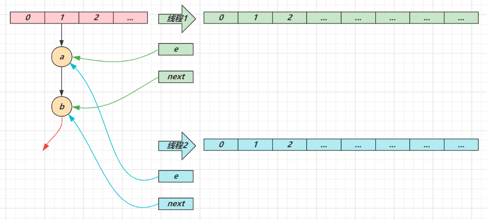
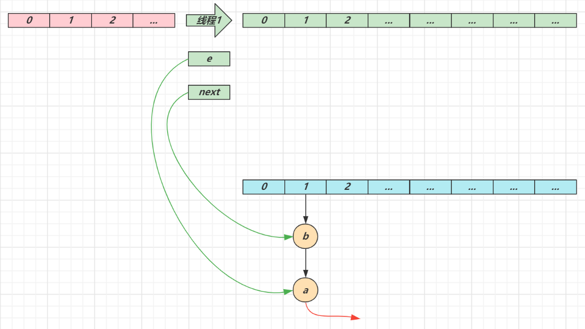
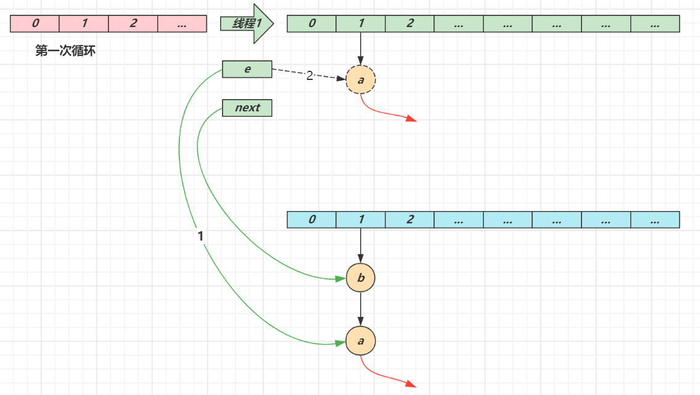
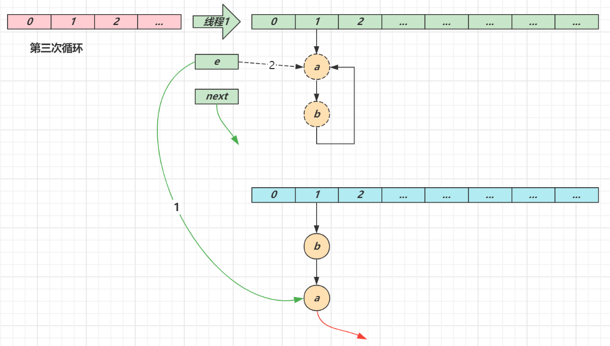

# 基础篇

> ***基础篇要点：算法、数据结构、基础设计模式***

## 1.查找

### 1.1 二分查找

**要求**

* 能够用自己语言描述二分查找算法
* 能够手写二分查找代码
* 能够解答一些变化后的考法

**算法描述**

1. 前提：有已排序数组 A（假设已经做好）

2. 定义左边界 L、右边界 R，确定搜索范围，循环执行二分查找（3、4两步）

3. 获取中间索引 M = Floor((L+R) /2)

4. 中间索引的值  A[M] 与待搜索的值 T 进行比较

   ① A[M] == T 表示找到，返回中间索引

   ② A[M] > T，中间值右侧的其它元素都大于 T，无需比较，中间索引左边去找，M - 1 设置为右边界，重新查找

   ③ A[M] < T，中间值左侧的其它元素都小于 T，无需比较，中间索引右边去找， M + 1 设置为左边界，重新查找

5. 当 L > R 时，表示没有找到，应结束循环

> *更形象的描述请参考：binary_search.html*

**算法实现**

```java
public static int binarySearch(int[] a, int t) {
    int l = 0, r = a.length - 1, m;
    while (l <= r) {
        m = (l + r) / 2;
        if (a[m] == t) {
            return m;
        } else if (a[m] > t) {
            r = m - 1;
        } else {
            l = m + 1;
        }
    }
    return -1;
}
```

**测试代码**

```java
public static void main(String[] args) {
    int[] array = {1, 5, 8, 11, 19, 22, 31, 35, 40, 45, 48, 49, 50};
    int target = 47;
    int idx = binarySearch(array, target);
    System.out.println(idx);
}
```

**解决整数溢出问题**

当 l 和 r 都较大时，`l + r` 有可能超过整数范围，造成运算错误，解决方法有两种：

```java
int m = l + (r - l) / 2;
```

还有一种是：

```java
int m = (l + r) >>> 1;
```

**其它考法**

1. 有一个有序表为 1,5,8,11,19,22,31,35,40,45,48,49,50 当二分查找值为 48 的结点时，查找成功需要比较的次数 

2. 使用二分法在序列 1,4,6,7,15,33,39,50,64,78,75,81,89,96 中查找元素 81 时，需要经过（   ）次比较

3. 在拥有128个元素的数组中二分查找一个数，需要比较的次数最多不超过多少次

对于前两个题目，记得一个简要判断口诀：奇数二分取中间，偶数二分取中间靠左。对于后一道题目，需要知道公式：

$$n = log_2N = log_{10}N/log_{10}2$$

其中 n 为查找次数，N 为元素个数

- **思考：找到与该数字相等的所有元素的下标**

```
public class BinarySearch {
    public static ArrayList<Integer> search(int[] arr, int n){
        int left = 0;
        int right = arr.length;
        ArrayList<Integer> list = new ArrayList<>();
        while (left <= right){
            int mid = (left + right) / 2;
            if(arr[mid] < n){
                left = mid + 1;
            }else if(arr[mid] > n){
                right = mid - 1;
            }else{
                list.add(mid);
                int i = mid;
                while (++i < arr.length && arr[i] == n){
                    list.add(i);
                }
                i = mid;
                while(--i >= 0 && arr[i] == n){
                    list.add(i);
                }
                break; //注意这里要break
            }
        }
        return list;
    }
}
```

### 1.2 插值查找（自适应）


```
public class InsertValueSearch {
    public static int search(int[] arr, int n){
        int left = 0;
        int right = arr.length - 1;

        int num = 0;

        while(left <= right || arr[left] <= n || arr[right] >= n){ //多加了一些判断，避免计算内存越界
            int mid = left + (n - arr[left]) / (arr[right] - arr[left]) * (right - left);
            num++;
            if(arr[mid] < n){
                left = mid + 1;
            }else if(arr[mid] > n){
                right = mid - 1;
            }else{
                System.out.println("排序了" + num + "次");
                return mid;
            }
        }
        return -1;
    }
}
```

1)对于数据量较大，**关键字分布比较均匀**的查找表来说，采用插值查找,速度较快.

2)关键字分布不均匀（跳跃性很大）的情况下，该方法不一定比二分查找要好

### 1.3  斐波那契(黄金分割法)查找算法

mid = low + f(k-1) + 1 //找到黄金分割点附近

```
public class FibonacciSearch {
    public static int search(int[] arr, int n){
        int left = 0;
        int right = arr.length - 1;

        int[] f = fib(20);
        int k = 0;
        while(f[k] < right + 1){ //注意f(k)表示的是数组的长度，并且要大于等于原数组的长度。以0开始，故索引要-1
            k++;
        }
        int[] temp = Arrays.copyOf(arr, f[k]);
        for(int i = right + 1; i < f[k]; i++){ //补齐数组
            temp[i] = temp[right];
        }

        while(left <= right){
            int mid = left + f[k - 1] - 1; //将本轮区间按黄金分割比分割，一段长f[k-1]，另一段长度f[k-2]。注意索引要 -1
            if(n < temp[mid]){
                right = mid - 1;
                k--; //注意这里，理解为下一轮区间长度是f[k-1]
            }else if(n > temp[mid]){
                left = mid + 1;
                k -= 2; //注意这里，理解为下一轮区间长度是f[k-2]
            }else{
                if(mid <= right) return mid;
                else return right; //注意这里，一旦mid超过right的范围，需要返回right
            }
        }
        return -1;
    }

    public static int[] fib(int k){
        int[] arr = new int[k];
        arr[1] = 1;
        arr[0] = 1;
        for(int i = 2; i < k; i++){
            arr[i] = arr[i - 1] + arr[i - 2];
        }
        return arr;
    }
}
```

斐波那契查找的时间复杂度还是O(log 2 n )，但是 与折半查找相比，斐波那契查找的优点是它只涉及加法和减法运算，而不用除法，而除法比加减法要占用更多的时间，因此，斐波那契查找的运行时间理论上比折半查找小，但是还是得视具体情况而定，二分法可能用“>>1”要好点。

## 2. 排序


```
备注：
稳定：如果a原本在b前面，而a=b，排序之后a仍然在b的前面；
不稳定：如果a原本在b的前面，而a=b，排序之后a可能会出现在b的后面；
内排序：所有排序操作都在内存中完成；
外排序：由于数据太大，因此把数据放在磁盘中，而排序通过磁盘和内存的数据传输才能进行；

时间复杂度： 一个算法执行所耗费的时间。
空间复杂度：运行完一个程序所需内存的大小。
n: 数据规模
k: “桶”的个数
In-place:    不占用额外内存
Out-place: 占用额外内存
```

### 2.1 冒泡排序

（可以优化2次）

一次while，一次for

 **要求**

* 能够用自己语言描述冒泡排序算法
* 能够手写冒泡排序代码
* 了解一些冒泡排序的优化手段

**算法描述**

1. 依次比较数组中相邻两个元素大小，若 a[j] > a[j+1]，则交换两个元素，两两都比较一遍称为一轮冒泡，结果是让最大的元素排至最后
2. 重复以上步骤，直到整个数组有序

> *更形象的描述请参考：bubble_sort.html*

**算法实现**

```java
public static void bubble(int[] a) {
    for (int j = 0; j < a.length - 1; j++) {
        // 一轮冒泡
        boolean swapped = false; // 是否发生了交换
        for (int i = 0; i < a.length - 1 - j; i++) {
            System.out.println("比较次数" + i);
            if (a[i] > a[i + 1]) {
                Utils.swap(a, i, i + 1);
                swapped = true;
            }
        }
        System.out.println("第" + j + "轮冒泡"
                           + Arrays.toString(a));
        if (!swapped) {
            break;
        }
    }
}
```

* 优化点1：每经过一轮冒泡，内层循环就可以减少一次
* 优化点2：如果某一轮冒泡没有发生交换，则表示所有数据有序，可以结束外层循环
* 优化点3：每轮冒泡时，最后一次交换索引可以作为下一轮冒泡的比较次数，如果这个值为零，表示整个数组有序，直接退出外层循环即可

```java----优化点3
public static void bubble_v2(int[] a) {
    int n = a.length - 1;
    while (true) { //这里使用while就可以
        int last = 0; // 表示最后一次交换索引位置
        for (int i = 0; i < n; i++) {
            System.out.println("比较次数" + i);
            if (a[i] > a[i + 1]) {
                Utils.swap(a, i, i + 1);
                last = i;
            }
        }
        n = last;
        System.out.println("第轮冒泡"
                           + Arrays.toString(a));
        if (n == 0) {
            break;
        }
    }
}
```


### 2.2. 选择排序

（优化：保证每轮外层循环只交换一次）

两个for

**要求**

* 能够用自己语言描述选择排序算法
* 能够比较选择排序与冒泡排序
* 理解非稳定排序与稳定排序

**算法描述**

1. 将数组分为两个子集，排序的和未排序的，每一轮从未排序的子集中选出最小的元素，放入排序子集

2. 重复以上步骤，直到整个数组有序

> *更形象的描述请参考：selection_sort.html*

**算法实现**

```java
public static void selection(int[] a) {
    for (int i = 0; i < a.length - 1; i++) {
        // i 代表每轮选择最小元素要交换到的目标索引
        int s = i; // 代表最小元素的索引
        for (int j = s + 1; j < a.length; j++) {
            if (a[s] > a[j]) { // j 元素比 s 元素还要小, 更新 s
                s = j;
            }
        }
        if (s != i) {
            swap(a, s, i);
        }
        System.out.println(Arrays.toString(a));
    }
}
```

* 优化点：为减少交换次数，每一轮可以先找最小的索引，在每轮最后再交换元素

**与冒泡排序比较**

1. 二者平均时间复杂度都是 $O(n^2)$

2. 选择排序一般要快于冒泡，因为其交换次数少

3. 但如果集合有序度高，冒泡优于选择

4. 冒泡属于稳定排序算法，而选择属于不稳定排序
   * 稳定排序指，按对象中不同字段进行多次排序，不会打乱同值元素的顺序
   * 不稳定排序则反之

**稳定排序与不稳定排序**

```java
System.out.println("=================不稳定================");
Card[] cards = getStaticCards();
System.out.println(Arrays.toString(cards));
selection(cards, Comparator.comparingInt((Card a) -> a.sharpOrder).reversed());
System.out.println(Arrays.toString(cards));
selection(cards, Comparator.comparingInt((Card a) -> a.numberOrder).reversed());
System.out.println(Arrays.toString(cards));

System.out.println("=================稳定=================");
cards = getStaticCards();
System.out.println(Arrays.toString(cards));
bubble(cards, Comparator.comparingInt((Card a) -> a.sharpOrder).reversed());
System.out.println(Arrays.toString(cards));
bubble(cards, Comparator.comparingInt((Card a) -> a.numberOrder).reversed());
System.out.println(Arrays.toString(cards));
```

都是先按照花色排序（♠♥♣♦），再按照数字排序（AKQJ...）

* 不稳定排序算法按数字排序时，会打乱原本同值的花色顺序

  ```
  [[♠7], [♠2], [♠4], [♠5], [♥2], [♥5]]
  [[♠7], [♠5], [♥5], [♠4], [♥2], [♠2]]
  ```

  原来 ♠2 在前 ♥2 在后，按数字再排后，他俩的位置变了

* 稳定排序算法按数字排序时，会保留原本同值的花色顺序，如下所示 ♠2 与 ♥2 的相对位置不变

  ```
  [[♠7], [♠2], [♠4], [♠5], [♥2], [♥5]]
  [[♠7], [♠5], [♥5], [♠4], [♠2], [♥2]]
  ```


### 2.3. 插入排序

一次for，一次while

**要求**

* 能够用自己语言描述插入排序算法
* 能够比较插入排序与选择排序

**算法描述**

1. 将数组分为两个区域，排序区域和未排序区域，每一轮从未排序区域中取出第一个元素，插入到排序区域（需保证顺序）

2. 重复以上步骤，直到整个数组有序

> *更形象的描述请参考：insertion_sort.html*

**算法实现**（升序）

```java
// 修改了代码与希尔排序一致
public static void insert(int[] a) {
    // i 代表待插入元素的索引
    for (int i = 1; i < a.length; i++) {
        int t = a[i]; // 代表待插入的元素值
        int j = i;
        System.out.println(j);
        while (j >= 1) {
            if (t < a[j - 1]) { // j-1 是上一个元素索引，如果 > t，后移
                a[j] = a[j - 1];
                j--;
            } else { // 如果 j-1 已经 <= t, 则 j 就是插入位置
                break;
            }
        }
        a[j] = t; //可以避免最左侧元素未与t交换的情况
        System.out.println(Arrays.toString(a) + " " + j);
    }
}
```

```
//相似的实现方式
package com.sort;
public class 插入排序 {
    public static void sort(int[] arr){
        int len = arr.length;
        for(int i = 0; i < len - 1; i++){ //i的初始值不同
            if(arr[i + 1] >= arr[i]) continue;
            int temp = arr[i+1];
            int j = i; //j的值在循环外还有用
            while(j >= 0 && temp < arr[j]){
                arr[j + 1] = arr[j];  //移位
                j--;
            }
            arr[j+1] = temp; //注意这里要+1，上次移位的数字所在位置
        }
    }
}
```

**与选择排序比较**

1. 二者平均时间复杂度都是 $O(n^2)$
2. 大部分情况下，**插入都略优于选择排序**
3. 插入排序不需要交换，只需要元素移动即可（每次交换需要移动三次元素）
4. 有序集合插入的时间复杂度为 $O(n)$，如1,2,3,4,5
4. 插入属于稳定排序算法，而选择属于不稳定排序

**提示**

> *插入排序通常被同学们所轻视，其实它的地位非常重要。小数据量排序，都会优先选择插入排序*


### 2.4. 希尔排序

**要求**

* 能够用自己语言描述希尔排序算法，不一定会写

**算法描述**

1. 首先选取一个间隙序列，如 (n/2，n/4 … 1)，n 为数组长度

2. 每一轮将间隙相等的元素视为一组，对一组内的元素进行插入排序，目的有二

   ① 少量元素插入排序速度很快

   ② 让组内值较大的元素更快地移动到后方：解决了普通插入排序存在的问题，即数值大的元素移动次数过多

3. 当间隙逐渐减少，直至为 1 时，即可完成排序

> *更形象的描述请参考：shell_sort.html*

**算法实现（了解）**

```java
private static void shell(int[] a) {
    int n = a.length;
    for (int gap = n / 2; gap > 0; gap /= 2) {
        // i 代表待插入元素的索引
        for (int i = gap; i < n; i++) {
            int t = a[i]; // 代表待插入的元素值
            int j = i;
            while (j >= gap) {
                // 每次与上一个间隙为 gap 的元素进行插入排序，即组内插入排序
                if (t < a[j - gap]) { // j-gap 是上一个元素索引，如果 > t，后移
                    a[j] = a[j - gap];
                    j -= gap;
                } else { // 如果 j-1 已经 <= t, 则 j 就是插入位置
                    break;
                }
            }
            a[j] = t;
            System.out.println(Arrays.toString(a) + " gap:" + gap);
        }
    }
}
```

```
//类似实现
package com.sort;
public class 希尔排序 {
    public static void sort(int[] arr){
        int len = arr.length;
        for(int gap = len/2; gap >= 1; gap /= 2){ //注意这里是 gap/=2
            for(int i = gap; i < len; i += 1){ //注意这里是 i=gap，且i+=1
                if(arr[i] >= arr[i - gap]) continue;
                int temp = arr[i];
                int j = i;
                while(j >= gap && temp < arr[j - gap]){ //注意这里是 j>=gap
                    arr[j] = arr[j - gap];
                    j -= gap;
                }
                arr[j] = temp;
            }
        }
    }
}
```

**参考资料**

* https://en.wikipedia.org/wiki/Shellsort


### 2.5. 快速排序

**要求**

* 能够用自己语言描述快速排序算法
* 掌握手写单边循环、双边循环代码之一
* 能够说明快排特点
* 了解洛穆托与霍尔两种分区方案的性能比较

**算法描述**

1. 每一轮排序选择一个基准点（pivot）进行分区
   1. 让小于基准点的元素的进入一个分区，大于基准点的元素的进入另一个分区
   2. 当分区完成时，基准点元素的位置就是其最终位置
2. 在子分区内重复以上过程，直至子分区元素个数少于等于 1，这体现的是分而治之的思想 （[divide-and-conquer](https://en.wikipedia.org/wiki/Divide-and-conquer_algorithm)）
3. 从以上描述可以看出，一个关键在于分区算法，常见的有洛穆托分区方案、双边循环分区方案、霍尔分区方案

> *更形象的描述请参考：quick_sort.html*


**单边循环快排（lomuto 洛穆托分区方案）**

1. 选择最右元素作为基准点元素

2. j 指针负责找到比基准点小的元素，一旦找到则与 i 进行交换

3. i 指针维护小于基准点元素的边界，也是每次交换的目标索引

4. 最后基准点与 i 交换，i 即为分区位置

```java
public static void quick(int[] a, int l, int h) {
    if (l >= h) {
        return;
    }
    int p = partition(a, l, h); // p 索引值
    quick(a, l, p - 1); // 左边分区的范围确定
    quick(a, p + 1, h); // 左边分区的范围确定
}

private static int partition(int[] a, int l, int h) {
    int pv = a[h]; // 基准点元素
    int i = l;
    for (int j = l; j < h; j++) {
        if (a[j] < pv) {
            if (i != j) { //i已经在j的位置上，所以不需要交换
                swap(a, i, j);
            }
            i++;
        }
    }
    if (i != h) { //优化
        swap(a, h, i);
    }
    System.out.println(Arrays.toString(a) + " i=" + i);
    // 返回值代表了基准点元素所在的正确索引，用它确定下一轮分区的边界
    return i;
}
```


**双边循环快排（不完全等价于 hoare 霍尔分区方案）**

1. *我常用的方法与其它双边循环快排的不同点在于：本方法不是两侧都找到后才开始交换，而是找到一侧的就可以，**右左交替被赋值**；
   同时当前找到点（high或者low）的值暂时不变，等待被下一处找到的点赋值
2. 选择最左元素作为基准点元素
3. j 指针负责从右向左找比基准点小的元素，i 指针负责从左向右找比基准点大的元素，一旦找到二者交换，直至 i，j 相交
3. 最后基准点与 i（此时 i 与 j 相等）交换，i 即为分区位置

要点

1. 基准点在左边，并且要先 j 后 i

2. while( **i** **< j** && a[j] > pv ) j-- 
3. while ( **i** **< j** && a[i] **<=** pv ) i++

```java
private static void quick(int[] a, int l, int h) {
    if (l >= h) {
        return;
    }
    int p = partition(a, l, h);
    quick(a, l, p - 1);
    quick(a, p + 1, h);
}

private static int partition(int[] a, int l, int h) {
    int pv = a[l];
    int i = l;
    int j = h;
    while (i < j) {
        // j 从右找小的
        while (i < j && a[j] > pv) {
            j--;
        }
        // i 从左找大的
        while (i < j && a[i] <= pv) { //等于号是为了跳过基准点元素，否则基准点将会发生变化
            i++;
        }
        swap(a, i, j); //这种方法与我常用的方法的区别是，这种方法的基准点不变，我的方法中保存了基准点的值，第一次循环结束就改变基准点
    }
    swap(a, l, j); //注意，i的位置左侧指针一定已经到达过，此处的值一定小于等于基准值
    System.out.println(Arrays.toString(a) + " j=" + j);
    return j;
}
```

```java
public class QuickSort {
    int[] arr;
    public int[] sort( int[] arr) {
        this.arr = arr;
        recur(0, arr.length-1);
        return this.arr;
    }
    public void recur(int l, int r){ //也可以取消成员变量arr，作为形参传入
        if(l>=r) return;
        int low=l;
        int high=r;
        int tmp=arr[l];
        while(low<high){
            //与其它双边循环快排的不同点在于：本方法不是两侧都找到后才开始交换，而是找到一侧的就可以，右左交替被赋值；
            // 同时找到处的值暂时不变，等待被下一处找到的点赋值
            //如果先左边后右边的话，会导致先给r处元素赋值，但r处元素的值没有备份（只备份了l处元素）
            while(low<high&&arr[high]>=tmp) high--; //如果不加等号会陷入死循环，即low和high之间无限次交换
            arr[low]=arr[high];
            while(low<high&&arr[low]<=tmp) low++;
            arr[high]=arr[low];
        }
        arr[low]=tmp;
        recur(l, low-1);
        recur(low+1, r);
    }
}
```

**快排特点**

1. **平均**时间复杂度是 $O(nlog_2⁡n )$，最坏时间复杂度 $O(n^2)$（如元素都相同，或者传入的数组有序）
2. **数据量较大时**，优势非常明显
3. 属于不稳定排序
4. 改进，优化最坏时间复杂度：1）选取左端，右端和中心的中值作为基准元素（随机化选取也可以）。2）在分区的时候，将序列分为 3 堆，一堆小于基准元素，一堆等于基准元素，一堆大于基准元素。3）元素个数较少时改用插入排序。

**洛穆托分区方案 vs 霍尔分区方案**

* 霍尔的移动次数平均来讲比洛穆托少3倍
* https://qastack.cn/cs/11458/quicksort-partitioning-hoare-vs-lomuto

> ***补充代码说明***
>
> * day01.sort.QuickSort3 演示了空穴法改进的双边快排，比较次数更少
> * day01.sort.QuickSortHoare 演示了霍尔分区的实现
> * day01.sort.LomutoVsHoare 对四种分区实现的移动次数比较


### 2.6. 归并排序

**思想**：

归并排序的核心思想是分治，把一个复杂问题拆分成若干个子问题来求解。 归并排序的算法思想是：把数组从中间划分为两个子数组，一直递归地把子数组划分成更小的数组，直 到子数组里面只有一个元素的时候开始排序。排序的方法就是按照大小顺序合并两个元素。接着依次按 照递归的顺序返回，不断合并排好序的数组，直到把整个数组排好序。

**代码：**

```java
public class MergeSort {
    public static void sort(int[] arr){
        int[] temp=new int[arr.length];
        sort(arr, 0, arr.length-1, temp);
    }
    
    public static void sort(int[] arr, int l, int r, int[] temp){
        if(l<r){
            int mid=(l+r)/2;
            sort(arr, l, mid, temp);
            sort(arr, mid+1, r, temp);
            merge(arr, l, r, temp);
        }
    }

    public static void merge(int[] arr, int l, int r, int[] temp){
        int k = l;
        int mid=(l+r)/2;
        int i=l;
        int j=mid+1;
        while(i<=mid && j<=r){
            if(arr[i]>arr[j]){
                temp[k++]=arr[j++];
            }else{
                temp[k++]=arr[i++];
            }
        }

        while(i<=mid){
                temp[k++]=arr[i++];
        }

         while(j<=r){
                temp[k++]=arr[j++];
         }

        while(l<=r){ //拷贝
            arr[l]=temp[l++];
        }
    }
}

```

**特点：**

始终都是O(nlogn）的时间复杂度。代价是需要额外的内存空间。


### 2.7. 堆排序（Heap Sort）

**思想：**

以从小到大排序为例

- 将初始待排序关键字序列(R1,R2….Rn)构建成大顶堆，此堆为初始的无序区；
- 将堆顶元素R[1]与最后一个元素R[n]交换，此时得到新的无序区(R1,R2,……Rn-1)和新的有序区(Rn),且满足R[1,2…n-1]<=R[n]；
- 由于交换后新的堆顶R[1]可能违反堆的性质，因此需要对当前无序区(R1,R2,……Rn-1)调整为新堆，然后再次将R[1]与无序区最后一个元素交换，得到新的无序区(R1,R2….Rn-2)和新的有序区(Rn-1,Rn)。不断重复此过程直到有序区的元素个数为n-1，则整个排序过程完成。

**代码：**

```java
public class HeapSort {
    public static void sort(int[] arr){ 
        int len = arr.length;
        //为arr构建成大顶堆
        for(int i=(arr.length-1)/2; i>=0; i--){ //注意：从最大索引的根节点开始往上/往左构建大顶堆
            heapify(arr, i, len);
        }
        //堆顶元素R[1]与最后一个元素R[n]交换，每次循环后len--
        for(int i = arr.length-1; i > 0; i--){
             swap(arr, 0, i);
             len--;
             heapify(arr, 0, len);
         }
    }

    public static void heapify(int[] arr, int i, int len){
        if(i>=len) return; //递归跳出，可以省略
        int left = 2*i+1;
        int right = 2*i+2;
        int max = i;
        if(left < len && arr[max] < arr[left]) max = 2 * i + 1;
        if(right < len && arr[max] < arr[right]) max = 2 * i + 2;
        if(max != i) {
            swap(arr, max, i);
            heapify(arr, max, len); //注意这里
        }
    }
    
    public static void swap(int[] arr, int a, int b){
        int temp = arr[a];
        arr[a] = arr[b];
        arr[b] = temp;
    }
}
```


### 2.8. 计数排序

计数排序不是基于比较的排序算法，其核心在于将输入的数据值转化为键存储在额外开辟的数组空间中。 作为一种线性时间复杂度的排序，计数排序要求输入的数据必须是有确定范围的整数。

**思想：**

- 找出待排序的数组中最大和最小的元素；
- 统计数组中每个值为i的元素出现的次数，存入数组bucket的第i项；
- 对所有的计数累加（从bucket中的第一个元素开始，每一项和前一项相加）；
- 反向填充目标数组：将每个元素i放在新数组的第C(i)项，每放一个元素就将C(i)减去1。

**代码：**

```java
public class SortCount {
    //只能排序正整数，默认最小值为0，需要传入最大值
    public static void sort(int[] arr, int maxValue){
        int[] bucket = new int[maxValue+1];
        for(int i : arr){
            bucket[i]++;
        }
        int index = 0;
        for(int j = 0; j < maxValue+1; j++){
            while(bucket[j] > 0){
                arr[index++] = j;
                bucket[j]--;
            }
        }
    }
}
```

按最大、最小值排序：

```
public class 计数排序 {
    public static void sort(int[] arr){
        int min = arr[0];
        int max = min;
        for(int i : arr){
            min = Math.min(min, i);
            max = Math.max(max, i);
        }

        int[] temp = new int[max- min + 1];
        for(int i : arr){
            temp[i - min] += 1;
        }

        int index = 0;
        for(int i = 0; i < temp.length; i++){
            int num = temp[i];
            while(num > 0){
                arr[index++] = i + min;
                num--;
            }
        }
    }
}
```

计数排序是一个稳定的排序算法。当输入的元素是 n 个 0到 k 之间的整数时，时间复杂度是O(n+k)，空间复杂度是O(k)，其排序速度快于任何比较排序算法。当**k不是很大并且序列比较集中**时，计数排序是一个很有效的排序算法。


### 2.9. 桶排序

桶排序是计数排序的升级版。它利用了函数的映射关系，高效与否的关键就在于这个映射函数的确定。桶排序 (Bucket  sort)的工作的原理：假设输入数据服从均匀分布，将数据分到有限数量的桶里，每个桶再分别排序（有可能再使用别的排序算法或是以递归方式继续使用桶排序进行排）。

**思想：**

- 设置一个定量的数组当作空桶；
- 遍历输入数据，并且把数据一个一个放到对应的桶里去；
- 对每个不是空的桶进行排序（可以递归使用桶排序）；
- 从不是空的桶里把排好序的数据拼接起来。 

**代码：**

```java
class BucketSort2{
    public static void sort(int[] arr){
        int maxValue = arr[0];
        int minValue = arr[0];
        for(int i : arr){
            maxValue = Math.max(maxValue, i);
            minValue = Math.min(minValue, i);
        }
		
		//创建各个桶
        int size = arr.length;
        int bucketNum = (maxValue - minValue) / size + 1; //加1可以放入最大值
        ArrayList<ArrayList<Integer>> buckets = new ArrayList<>(bucketNum); //每个桶也使用ArrayList
        for(int i = 0; i < bucketNum; i++){
            buckets.add(new ArrayList<Integer>());
        }
		
		//将每个元素放入桶（即ArrayList）
        for(int i : arr){
            buckets.get((i - minValue) / size).add(i);
        }
		
		//对每个桶进行排序
        for(ArrayList<Integer> bucket : buckets){
            Collections.sort(bucket);
            //sort(bucket)，参考https://www.cnblogs.com/guoyaohua/p/8600214.html
        }
        
		//遍历输出
        int index = 0;
        for(ArrayList<Integer> bucket : buckets){
            for(int i : bucket){
                arr[index++] = i;
            }
        }
    }
}
```

<!--假设有n个数字，有m个桶，如果数字是平均分布的，则每个桶里面平均有n/m个数字。如果每个桶里中的数字采用快速排序，那么整个算法的复杂度是O（n+m\*n/m*log（n/m）） = O（n+nlogn-nlogm）.当m接近n时，桶排序复杂度接近O（n）。-->

桶排序的时间复杂度和空间复杂度都是O(n)，并且桶排序是一种稳定的排序算法。很显然，桶越小，各个桶的数据越少，排序所用的时间也会越少。但相应的空间消耗就会增大。 每个桶的大小为1时即为计数排序。

当输入的数据可以均匀的分配到每一个桶中效率最快。但因为如果元素分布不均衡，比如大多数元素都集中在同一个桶中，这样桶排序的时间复杂度就会退化为O(n^2)，而且还浪费了空间。(桶内若采用快排，则退化为（O(nlgn))。


### 2.10. 基数排序

基数排序是按照低位先排序，然后收集（如356和355）；再按照高位排序，然后再收集（如556和356）；依次类推，直到最高位。有时候有些属性（不一定是数字）是有优先级顺序的，先按低优先级排序，再按高优先级排序。最后的次序就是高优先级高的在前，高优先级相同而低优先级高的在前。

**思路：**

- 取得数组中的最大数，并取得其位数；
- 从最低位开始取每个位组成radix数组，即对radix进行计数排序（利用计数排序适用于小范围数的特点）；
- 每一位排序完成后，复制到原arr数组，然后再对更高位计数排序

**代码：**

```Java
public class RadixSort {
    public static void sort(int[] arr){
        int maxValue = arr[0];
        for(int i : arr){
            maxValue = Math.max(maxValue, i);
        }
        //最大的位数
        int maxDigit = 0;
        while(maxValue != 0){
            maxValue /= 10;
            maxDigit++;
        }
        ArrayList<ArrayList<Integer>> buckets = new ArrayList<>(10);
        for(int i = 0; i < 10; i++){ //只需要10个桶
            buckets.add(new ArrayList<Integer>());
        }
        int div = 1;
        for(int i = 0; i < maxDigit; i++, div *= 10){ //从低位到高位
            for (int j = 0; j < arr.length; j++) {
                int num = (arr[j] / div) % 10; //找到arr[j]中当前位的数字，进行计数排序
                buckets.get(num).add(arr[j]);
            }
			
            //复制
            int index = 0;
            for(int m = 0; m < buckets.size(); m++){
                for(int n = 0; n < buckets.get(m).size(); n++){
                    arr[index++] = buckets.get(m).get(n);
                }
                //清空每一个桶，便于下次使用
                buckets.get(m).clear();
            }
        }
    }
}
```

注意：**(arr[j] / div) % 10** 方便计算当前位的数字

上面的代码负数不可用

```
//可以排序负数
public class 基数排序 {
    public static void sort(int[] arr){
        ArrayList<ArrayList<Integer>> buckets = new ArrayList<>(10);
        for(int i = 0; i < 10; i++){
            buckets.add(new ArrayList<Integer>());
        }

        int max = arr[0];
        for(int i : arr){
            max = Math.max(max, Math.abs(i)); //注意这里统计绝对值的最大值
        }

        int maxDigit = (max + "").length(); //这里很巧妙

        int div = 1;
        while(maxDigit > 0){ //最高位
            maxDigit--;
            for(int i : arr){
                int abs = Math.abs((i/div)%10);
                buckets.get(abs).add(i);
            }

            int index1 = 0;
            for(ArrayList<Integer> bucket : buckets){
                for(int i : bucket){
                    arr[index1++] = i; //判断正负
                }
                bucket.clear(); //桶要清空
            }
            div *= 10; //每次乘10
        }

        LinkedList<Integer> list = new LinkedList<>(); //正负分离
        for(int i : arr){
            if(i < 0) list.addFirst(i);
            else list.addLast(i);
        }
        int index = 0;
        for(int i : list){
            arr[index++] = i;
        }
    }
}
```

**总结：**

1. 有低位（代码中）和高位排序两种，高位排序可以采用递归的方式，属于分治的思想
2. 时间复杂度：最佳情况：T(n) = O(n \* k)  最差情况：T(n) = O(n \* k)  平均情况：T(n) = O(n \* k)，k指maxDigit，最大位数
3. 空间复杂度：O(n+k)，其中k为桶的数量。一般来说n>>k，因此额外空间需要大概n个左右，因为采用了ArrayList，而不是数组，可以自动扩容，不需要O(n*k)的空间复杂度
4. 基数排序 vs 计数排序 vs 桶排序
   - 计数排序：每个桶只存储单一键值
   - 桶排序：每个桶存储一定范围的数值
   - 基数排序：根据键值的每位数字来分配桶


## 3. 集合

### 2.1. ArrayList

**要求**

* 掌握 ArrayList 扩容规则

**扩容规则**

1. ArrayList() 会使用长度为零的数组，等到第一次add的时候再初始化为10。
2. ArrayList(int initialCapacity) 会使用指定容量的数组，采用数组扩容机制，每次都需要拷贝旧数据到新的数组
3. public ArrayList(Collection<? extends E> c) 会使用 c 的大小作为数组容量
4. 添加元素时，先判断是否扩容
5. add(Object o) 首次扩容为 10，**再次扩容为上次容量的 1.5 倍**（具体过程是len+len>>1，如15，扩容后是22）
6. addAll(Collection c) 没有元素时，扩容为 Math.max(10, 实际元素个数)，有元素时为 Math.max(原容量 1.5 倍, 实际元素个数)

其中第 4 点必须知道，其它几点视个人情况而定

**提示**

* 测试代码见 `day01.list.TestArrayList` ，这里不再列出
* 要**注意**的是，示例中用反射方式来更直观地反映 ArrayList 的扩容特征，但从 JDK 9 由于模块化的影响，对反射做了较多限制，需要在运行测试代码时添加 VM 参数 `--add-opens java.base/java.util=ALL-UNNAMED` 方能运行通过，后面的例子都有相同问题

> ***代码说明***
>
> * day01.list.TestArrayList#arrayListGrowRule 演示了 add(Object) 方法的扩容规则，输入参数 n 代表打印多少次扩容后的数组长度


### 2.2. Iterator

**要求**

* 掌握什么是 **Fail-Fast、什么是 Fail-Safe**

Fail-Fast 与 Fail-Safe

* ArrayList 是 fail-fast 的典型代表，遍历的同时不能修改，尽快失败。迭代器迭代元素的过程中不**能使用集合对象的remove**方法删除元素，
  要使用**迭代器Iterator的remove方法**来删除元素，防止出现异常。
* CopyOnWriteArrayList 是 fail-safe 的典型代表，遍历的同时可以修改，**原理是读写分离**

**提示**

* 测试代码见 `day01.list.FailFastVsFailSafe`，这里不再列出


### 2.3. LinkedList

**要求**

* 能够说清楚 LinkedList 对比 ArrayList 的区别，并重视纠正部分错误的认知

**LinkedList**

1. 基于双向链表，无需连续内存
2. 随机访问慢（要沿着链表遍历），头尾访问快
3. 头尾插入删除性能高，中间插入性能不一定比ArrayList高（因为需要遍历）
4. 占用内存多，存同样的元素个数，LinkedList大小是ArrayList的好几倍（每个节点占的内存太大）

**ArrayList**

1. 基于数组，需要连续内存
2. 随机访问快（指根据下标访问）
3. 尾部插入、删除性能可以，其它部分插入、删除都会移动数据，因此性能会低
4. 可以配合 cpu 缓存，局部性原理（缓存读取时会把目标内存相邻的元素也读入）

> ***代码说明***
>
> * day01.list.ArrayListVsLinkedList#randomAccess 对比随机访问性能
> * day01.list.ArrayListVsLinkedList#addMiddle 对比向中间插入性能
> * day01.list.ArrayListVsLinkedList#addFirst 对比头部插入性能
> * day01.list.ArrayListVsLinkedList#addLast 对比尾部插入性能
> * day01.list.ArrayListVsLinkedList#linkedListSize 打印一个 LinkedList 占用内存
> * day01.list.ArrayListVsLinkedList#arrayListSize 打印一个 ArrayList 占用内存


### 2.4. HashMap

**要求**

* 掌握 HashMap 的基本数据结构
* 掌握树化
* 理解索引计算方法、二次 hash 的意义、容量对索引计算的影响
* 掌握 put 流程、扩容、扩容因子
* 理解并发使用 HashMap 可能导致的问题
* 理解 key 的设计

#### 1）基本数据结构

* 1.7 数组 + 链表
* 1.8 数组 + （链表 | 红黑树）

> 更形象的演示，见资料中的 hash-demo.jar，运行需要 jdk14 以上环境，进入 jar 包目录，执行下面命令
>
> ```
> java -jar --add-exports java.base/jdk.internal.misc=ALL-UNNAMED hash-demo.jar
> http://localhost:8080/hashmapv8.html
> ```

#### 2）树化与退化

**树化意义**（或者说为什么不直接采用红黑树，阈值为何是8）

* 红黑树可以防止链表超长时性能下降，树化应当是**偶然**情况，是保底策略，正常情况下不采用红黑树。如用来避免 DoS 攻击（攻击者构造一大批相同hash值的元素）
 * hash 表的查找，更新的时间复杂度是 $O(1)$（常量级的查找），而红黑树的查找，更新的时间复杂度是 $O(log_2⁡n )$，TreeNode 占用空间也比普通 Node 的大，如非必要，尽量还是使用链表
 * hash 值如果足够随机，则在 hash 表内按泊松分布，在负载因子 0.75 的情况下，桶长度超过 8 的链表出现概率是 0.00000006，树化阈值选择 8 就是为了让树化几率足够小。正常情况下扩容就可以很好地解决桶内（链表）长度过长的问题。

**树化条件**

* 当链表长度超过树化**阈值 8 时**，先尝试扩容来减少链表长度
* 如果**数组容量已经 >=64**，才会进行树化

**退化条件**

* 情况1：在扩容时如果拆分树时，树元素个数 **<= 6** 则会退化链表
* 情况2：remove 树节点时，若 root、root.left、root.right、root.left.left 有一个为 null ，也会退化为链表

综上：红黑树中的元素个数可能为7

#### 3）**put 流程**

1. HashMap 是**懒惰创建数组**的，首次使用（put）才创建数组
2. 计算索引（桶下标）
3. 如果桶下标还没人占用，创建 Node 占位返回
4. 如果桶下标已经有人占用
   1. 已经是 TreeNode 走红黑树的添加或更新逻辑
   2. 是普通 Node，走链表的添加或更新逻辑，如果链表长度超过树化阈值，走树化逻辑
5. 返回前检查容量是否超过阈值（插入后检查），一旦超过进行扩容

**1.7 与 1.8 的区别**

1. 链表插入节点时，1.7 是头插法，1.8 是尾插法
2. 1.7 是大于等于阈值且没有空位时才扩容（被插入的位置桶还没被占用就不会扩容），而 1.8 是大于阈值就扩容（可能会多占点空间）
3. 1.8 在扩容计算 Node 索引时，会优化（即容量是2的n次幂的原因二）
4. 红黑树

#### 4）索引计算

**索引计算方法**

* 首先，计算对象的 hashCode()
* 再进行调用 HashMap 的 hash() 方法进行二次哈希
  * 二次 hash() 是为了综合高位数据，让哈希分布更为均匀
* 最后 & (capacity – 1) 得到索引

**数组容量为何是 2 的 n 次幂**：

1. **计算索引时效率更高**：如果是 2 的 n 次幂可以使用位与运算代替取模，即二次哈希结果& (capacity – 1) 
2. **扩容时重新计算索引效率更高**： hash & oldCap == 0 的元素留在原来位置 ，否则新位置 = 旧位置 + oldCap

**数组容量是 2 的 n 次幂缺点：**

- 数组容量扩容质数倍时哈希分布性更好

* **容量是 2 的 n 次幂** 这一设计虽然计算索引效率更好，但 hash 的分散性不好，需要二次 hash 来作为补偿。如果 hash 表的容量不是 2 的 n 次幂，则不必二次 hash
* 没有采用这一设计的典型例子是 Hashtable，其每次扩容为原来的二倍加一（2n+1）（如0,11,23,47,95）

#### 5）扩容（加载）因子

**为何默认是 0.75f：**

1. 在空间占用与查询时间之间取得较好的权衡
2. 大于这个值，空间节省了，但链表就会比较长影响性能
3. 小于这个值，冲突减少了，但扩容就会更频繁，空间占用也更多

#### 6）并发问题

**扩容死链（1.7 会存在）**

1.7 源码如下：

```java
void transfer(Entry[] newTable, boolean rehash) {
    int newCapacity = newTable.length;
    for (Entry<K,V> e : table) {
        while(null != e) {
            Entry<K,V> next = e.next;
            if (rehash) {
                e.hash = null == e.key ? 0 : hash(e.key);
            }
            int i = indexFor(e.hash, newCapacity);
            e.next = newTable[i];
            newTable[i] = e;
            e = next;
        }
    }
}
```

* e 和 next 都是局部变量，用来指向当前节点和下一个节点
* 线程1（绿色）的临时变量 e 和 next 刚引用了这俩节点，还未来得及移动节点，发生了线程切换，由线程2（蓝色）完成扩容和迁移



* 线程2 扩容完成，由于头插法，链表顺序颠倒。但线程1 的临时变量 e 和 next 还引用了这俩节点，还要再来一遍迁移



* 第一次循环
  * 循环接着线程切换前运行，注意此时 e 指向的是节点 a，next 指向的是节点 b
  * e 头插 a 节点，注意图中画了两份 a 节点，但事实上只有一个（为了不让箭头特别乱画了两份）
  * 当循环结束是 e 会指向 next 也就是 b 节点



* 第二次循环
  * next 指向了节点 a
  * e 头插节点 b
  * 当循环结束时，e 指向 next 也就是节点 a


* 第三次循环
  * next 指向了 null
  * e 头插节点 a，**a 的 next 指向了 b**（之前 a.next 一直是 null），b 的 next 指向 a，死链已成
  * 当循环结束时，e 指向 next 也就是 null，因此第四次循环时会**正常退出**



**数据错乱（1.7，1.8 都会存在）**

并发可能会出现数据丢失：后执行的线程覆盖掉前面线程插入的元素

使用Collections.synchronizedMap(Map map)方法，可以将HashMap变成一个同步的容器

* 代码参考 `day01.map.HashMapMissData`，具体调试步骤参考视频

> ***补充代码说明***
>
> * day01.map.HashMapDistribution 演示 map 中链表长度符合泊松分布
> * day01.map.DistributionAffectedByCapacity 演示容量及 hashCode 取值对分布的影响
>   * day01.map.DistributionAffectedByCapacity#hashtableGrowRule 演示了 Hashtable 的扩容规律
>   * day01.sort.Utils#randomArray 如果 hashCode 足够随机，容量是否是 2 的 n 次幂影响不大
>   * day01.sort.Utils#lowSameArray 如果 hashCode 低位一样的多，容量是 2 的 n 次幂会导致分布不均匀
>   * day01.sort.Utils#evenArray 如果 hashCode 偶数的多，容量是 2 的 n 次幂会导致分布不均匀
>   * 由此得出对于容量是 2 的 n 次幂的设计来讲，二次 hash 非常重要
> * day01.map.HashMapVsHashtable 演示了对于同样数量的单词字符串放入 HashMap 和 Hashtable 分布上的区别


#### 7）key 的设计

**key 的设计要求**

1. HashMap 的 key 可以为 null，但其它的Map（如TreeMap，HashTable）则不然
2. 作为 key 的对象，必须重写 hashCode 和 equals，并且 key 的内容不能修改（不可变）
3. key 的 hashCode 应该有良好的散列性

如果 key 可变，例如修改了 age 会导致再次查询时查询不到

```java
public class HashMapMutableKey {
    public static void main(String[] args) {
        HashMap<Student, Object> map = new HashMap<>();
        Student stu = new Student("张三", 18);
        map.put(stu, new Object());

        System.out.println(map.get(stu));

        stu.age = 19;
        System.out.println(map.get(stu));
    }

    static class Student {
        String name;
        int age;

        public Student(String name, int age) {
            this.name = name;
            this.age = age;
        }

        public String getName() {
            return name;
        }

        public void setName(String name) {
            this.name = name;
        }

        public int getAge() {
            return age;
        }

        public void setAge(int age) {
            this.age = age;
        }

        @Override
        public boolean equals(Object o) {
            if (this == o) return true;
            if (o == null || getClass() != o.getClass()) return false;
            Student student = (Student) o;
            return age == student.age && Objects.equals(name, student.name);
        }

        @Override
        public int hashCode() {
            return Objects.hash(name, age);
        }
    }
}
```


**String 对象的 hashCode() 设计**

* 目标是达到较为均匀的散列效果，每个字符串的 hashCode 足够独特
* 字符串中的每个字符都可以表现为一个数字，称为 $ S_i $，其中 i 的范围是 0 ~ n - 1，散列公式为：

$$
S_0∗31^{(n-1)}+ S_1∗31^{(n-2)}+ … S_i ∗ 31^{(n-1-i)}+ …S_{(n-1)}∗31^0
$$

* 选用31的原因：

  - 代入公式有较好的散列特性

  - 并且 31 * h 可以被优化为 

    ​	即 $32 ∗h -h $

    ​	即 $2^5  ∗h -h$

    ​	即 $h≪5  -h$

## 4. 树的结构

可以提高数据**存储**、**读取**的效率，比如二叉排序树，既可以保证数据的检索速度，同时又可以保证数据的插入、删除、修改的速度。

### 4.1 树的分类

完美二叉树（满二叉树）


完全二叉树


完满二叉树：所有非叶子结点的度都是2**。（**只要你有孩子，你就必然是有两个孩子） 


### 4.2 二叉树的遍历

```java
public class Method {
    public void preOrder(TreeNode node){
        if(node==null) return;
        System.out.println(node.val+" ");
        preOrder(node.left);
        preOrder(node.right);
    }

    public void midOrder(TreeNode node){
        if(node==null) return;
        midOrder(node.left);
        System.out.println(node.val+" ");
        midOrder(node.right);
    }

    public void postOrder(TreeNode node){
        if(node==null) return;
        postOrder(node.left);
        postOrder(node.right);
        System.out.println(node.val+" ");
    }

    //不使用递归
    //使用队列，每层一个
    public void levelOrder(TreeNode root){
        if(root==null) return;
        List<TreeNode> list=new LinkedList<>();
        list.add(root);
        while (!list.isEmpty()){
            List<TreeNode> tmp=new LinkedList<>();
            for(TreeNode node:list){
                if(node.left!=null) tmp.add(node.left);
                if(node.right!=null) tmp.add(node.right);
                System.out.println(node.val);
            }
            list=tmp;
        }
    }
}
```

### 4.3 顺序二叉树

顺序二叉树通常考虑完全二叉树

第n个元素的左子节点：2 \* n + 1 右子节点：2 \* n + 2       父节点：（n - 1) / 2

n是数组下标，从0开始编号

### 4.4 线索化二叉树

- **线索化的原因：**没有有效利用叶子结点的左右指针

1)n个结点的二叉链表中含有n+1 【公式 2n-(n-1)=n+1】 个空指针域。利用二叉链表中的空指针域，存放指向该[结点](https://baike.baidu.com/item/结点)在某种遍历次序下的前驱和后继结点的指针（这种附加的指针称为"线索"）

2)这种加上了线索的二叉链表称为线索链表，相应的二叉树称为线索二叉树(Threaded BinaryTree)。根据线索性质的不同，线索二叉树可分为前序线索二叉树、中序线索二叉树和后序线索二叉树三种

3)一个结点的前一个结点，称为**前驱**结点

4)一个结点的后一个结点，称为**后继**结点

- **中序线索二叉树为例：**


节点类：（需要加标签）


节点类修改过后的二叉树示意图如下：


以上是二叉树的视角，不过，若是分别从前继和后继的角度来看，其实可以看成一个双向链表：


红色代表前继，绿色代表后继。这实际上是代表了一种关系，可以说是先后关系，当然，也可以成为“线索”。根据这种线索，可以比较方便地查找到在中序遍历的方式中某个节点的前继节点或后继节点。

注意：蓝色方框里的1节点和14节点实际上是没有直接的后继关系的（当然，不仅仅是这两个节点之间）。虽然14节点的前继节点是1节点，这种关系很明确，但是1节点却不存在后继节点，只有右子节点6节点，而6节点又不存在前继节点，只有左子节点14节点。因此，从1节点到14节点并不是直接靠前继或者后继得到的，而是需要进一步的查找。这种方法在遍历函数中可以提现。由此可知，上述的双向链表实际上是一种**逻辑结构**，并不真正的是物理结构，这一点需要注意。
参考：https://blog.csdn.net/waldeinNJU/article/details/109271564

代码：

```
// 节点类
class Node{
    private int number;
    // 左右指针域
    private Node left;
    private Node right;
    // 左右指针域的标签
    // 标签设置默认为true，因为对于暂未线索化的二叉树而言
    // 左右指针域无论是否为空，都是指向孩子节点的
    // 当然，如果默认为false，我认为也行，稍加改动即可
    private boolean isLeftChild = true;
    private boolean isRightChild = true;
}

public void in_order_threaded(Node node){
    // 如果节点为空，无法线索化，这是函数递归停止的条件
	if (node == null){
		return;
	}

    // 首先对左子树做中序线索化
    in_order_threaded(node.getLeft());
    
    // 再对当前节点做中序线索化，处理的是当前节点的前继关系
    // 因为preNode指向的是当前节点的前一个结点
    // 因此，当当前节点Node的左子节点为null时，就将左指针域赋值为preNode
    // 并设置标签为false，表明左指针域指向的是前继节点
    if (node.getLeft() == null){
    	node.setLeft(preNode);
        node.setLeftChild(false);
    }
    // 处理上一个节点的后继关系
    // 在这个方法中，并没有直接处理Node节点的后继关系，因为此时并不会遍历到Node的后继节点
    // 于是，Node节点的后继关系处理放在了其下一个节点的处理中
    // 将Node赋值给preNode，preNode的右指针域指向Node（此处的Node为后继节点）
    if (preNode != null && preNode.getRight() == null){
        preNode.setRight(node);
        preNode.setRightChild(false);
    }
    
    // 当然，对当前节点处理完之后，preNode被赋值为Node
    preNode = node;
    
    // 最后对右子树做中序线索化
    in_order_threaded(node.getRight());
}

//遍历
public void list(){
	// 定义一个节点，表示遍历从根开始
    Node node = root;

    while (node != null){
        // 寻找左子树的遍历起始节点
    	while (node.isLeftChild()){
    		node = node.getLeft();
        }
        
        // 首先输出起始节点
        System.out.print(node.getNumber() + " ");
        // 按照后继关系，一直输出，知道右孩子节点位置
        while (!node.isRightChild()){
        	node = node.getRight();
            System.out.print(node.getNumber() + " ");
        }
        
        // 下一个循环从右孩子结点开始
        node = node.getRight();
    }
}
```

注意：遍历的过程可能有些复杂

- **前序线索二叉树：**

```
public void preOrderThread(TreeNode node){
        if(node == null) return;
        if(node.left == null){
            node.left = pre; //指向前驱节点
            node.typeL = 1;
        }

        if(pre != null && pre.right == null){
            pre.right = node; //前驱节点的后继节点指向当前节点
            pre.typeR = 1;
        }

        pre = node;
        if(node.typeL == 0) preOrderThread(node.left);
        if(node.typeR == 0) preOrderThread(node.right);
    }
```

遍历：

```
public static void 前序遍历线索化二叉树(TreeNode node){
        while (node != null){
            while (node.typeL == 0){
                System.out.printf("%d\t", node.val);
                node = node.left;
            }

            System.out.printf("%d\t", node.val);
            node = node.right;
        }
    }
```

### 4.5 哈夫曼树（Huffman Tree）

- 几个概念：

1)路径和路径长度：在一棵树中，从一个结点往下可以达到的孩子或孙子结点之间的通路，称为路径。通路中分支的数目称为路径长度。若规定根结点的层数为1，则从根结点到第L层结点的路径长度为L-1

2)**结点的权及带权路径长度：**若将树中结点赋给一个有着某种含义的数值，则这个数值称为该结点的权。**结点的带权路径长度**为：从根结点到该结点之间的路径长度与该结点的权的乘积

3)**树的带权路径长度：**树的带权路径长度规定为所有**叶子结点**的带权路径长度之和，记为WPL(weighted path length) ,**权值越大的结点离根结点越近的二叉树才是最优二叉树**。

4)**WPL**最小的就是赫夫曼树

- **构建哈夫曼树的步骤**：

构成赫夫曼树的步骤：

1)从小到大进行排序, 将每一个数据，每个数据都是一个节点 ， 每个节点可以看成是一颗最简单的二叉树

2)取出根节点权值最小的两颗二叉树 

3)组成一颗新的二叉树, 该新的二叉树的根节点的权值是前面两颗二叉树根节点权值的和 

4)再将这颗新的二叉树，以根节点的权值大小 再次排序， 不断重复 1-2-3-4 的步骤，直到数列中，所有的数据都被处理，就得到一颗赫夫曼树

- 代码：

```
public class HuffmanTree {
    public static Node creat(int[] arr){
        ArrayList<Node> list = new ArrayList<>();
        for(int i : arr){
            list.add(new Node(i));
        }

        while(list.size() > 1){ //注意size不能为1
            Collections.sort(list);
            System.out.println(list);
            Node left = list.get(0);
            Node right = list.get(1);
            Node parent = new Node(left.val + right.val);
            parent.left = left;
            parent.right = right;
            list.remove(left);
            list.remove(right);
            list.add(parent);
        }
        return list.get(0);
    }
}

class Node implements Comparable<Node> {
    int val;
    Node left;
    Node right;
    public Node(int val){
        this.val = val;
    }
    public String toString(){
        return "Node [ val = " +  val + " ] " ;
    }

    public int compareTo(Node o) {
        return this.val - o.val;
    }

}

class 测试{
    public static void main(String[] args) {
        int[] arr = {29,7,8,1,3,6,13};
        Node node = HuffmanTree.creat(arr);
        preOrder(node);
    }

    public static void preOrder(Node node){
        if(node==null) return;
        System.out.printf("%d\t", node.val);
        preOrder(node.left);
        preOrder(node.right);
    }
}
```

### 4.6 Huffman编码

赫夫曼编码广泛地用于数据文件压缩。其压缩率通常在**20%**～**90%**之间，属于**前缀编码**。huffman编码是无损压缩

- 通信领域中信息的处理方式3-赫夫曼编码

```
i like like like java do you like a java    // 共40个字符(包括空格)

d:1 y:1 u:1 j:2 v:2 o:2 l:4 k:4 e:4 i:5 a:5 :9 // 各个字符对应的个数
```

（1） 按照上面字符出现的次数构建一颗赫夫曼树, 出现的次数作为权值

（2） 创建Huffman码表：根据huffman树为每个字符编码，向左为0，向右为1

（3） 根据编码表，对需要编码的数据编码

注意：对相同值节点的排序规则不同，编码结果可能不同，但长度肯定相同

- 解码

（1） 将字节数组转为二进制字符串

（2） 反转编码表，二进制字符串为key，字节为value

（3） 根据反转后的码表，遍历二进制字符串，解码

- **赫夫曼编码压缩文件注意事项**

（1） 如果文件本身就是经过压缩处理的，那么使用赫夫曼编码再压缩效率不会有明显变化, 比如视频,ppt 等等文件 [举例压一个 .ppt]

（2） 赫夫曼编码是按字节来处理的，因此可以处理所有的文件(二进制文件、文本文件) [举例压一个.xml文件]

（3） 如果一个文件中的内容，重复的数据不多，压缩效果也不会很明显.

（4） 代码中，需要使用对象输入输出流

### 4.7 二叉排序树

二叉排序树，也可以称为二叉搜索树：BST: (Binary Sort(Search) Tree), 对于二叉排序树的任何一个非叶子节点，要求左子节点的值比当前节点的值小，右子节点的值比当前节点的值大。**特别说明**：如果有相同的值，可以将该节点放在左子节点或右子节点

- 添加数据比较简单
- 删除数据，分三种情况：a) 删除叶子结点；b) 删除只有一颗子树的节点；c) 删除有两棵子树的节点（找到右子树中最下的元素填入删除的节点；或者找到左子树节点中最大的元素来代替）

### 4.8 平衡二叉树

1)平衡二叉树也叫平衡二叉搜索树（Self-balancing binary search tree）又被称为AVL树， 可以**保证查询效率较高**，可以解决二叉排序树极端情况下退化为链表的问题。注意平衡二叉树要满足二叉排序树的条件。

2)具有以下特点：**它是一 棵空树或它的左右两个子树的高度差的绝对值不超过1，并且左右两个子树都是一棵平衡二叉树**。平衡二叉树的常用实现方法有[红黑树](https://baike.baidu.com/item/红黑树/2413209)、[AVL](https://baike.baidu.com/item/AVL/7543015)、[替罪羊树](https://baike.baidu.com/item/替罪羊树/13859070)、[Treap](https://baike.baidu.com/item/Treap)、[伸展树](https://baike.baidu.com/item/伸展树/7003945)等。

- 左旋转：当添加完一个元素后，右子树的长度不满足平衡二叉树的条件时，即（右子树的高度 - 左子树的高度）> 1


- 右旋转：当添加完一个元素后，（左子树的高度 - 右子树的高度）> 1，以降低左子树的高度


- 双旋转：结点的左子树的右子树高度大于它的左节点的高度。此时直接右旋转后，右子树的高度 - 左子树的高度 > 1。那么此时就需要双旋转，即先对当前结点的左节点进行左旋转，再对当前结点进行右旋转


- 另外一种理解

  a) 单旋转：插入点不介于 不满足AVL条件的树根 和 树根对应孩子节点之间； 

  

  b) 双旋转：插入点介于 不满足AVL条件的树根 和 树根对应孩子节点之间；


### 4.9 多路查找树

- 二叉树存在的问题是：二叉树的高度很大，并且在构建二叉树时需要多次进行I/O操作。这是因为：二叉树每个节点只能有两个子节点，所以数据一多构建出来的树的高度会很高。
- 多叉树允许每个节点有更多的数据项和更多的子节点

#### （1） 2-3树

2-3树是最简单的**B树**，它有以下特点：

- 首先它也要满足排序树的特点，即左子节点都比父节点小，右子节点都比父节点大，如果3节点，那么中间那个元素要介于左节点和右节点之间，即6是介于4和11之间的；

- 所有的叶子节点都在同一层(B树都满足这个条件)；

- 有两个子节点的叫二节点，二节点要么两个子节点，要么没有子节点；

- 有三个子节点的节点叫三节点，三节点要么有三个子节点，要么没有子节点；

- 2-3树就是由二节点和三节点构成的树。


#### （2）2-3-4树

和2-3树的区别就是，它还允许节点有三个元素且有四个子节点。


#### （3）B树

B-tree树即B树，B即Balanced，平衡的意思，**平衡多路查找树**。有人把B-tree翻译成B-树，容易让人产生误解。会以为B-树是一种树，而B树又是另一种树。实际上，**B-tree**就是指的B树。

前面已经介绍了2-3树和2-3-4树，他们就是B树(英语：B-tree 也写成B-树)，这里我们再做一个说明，我们在学习Mysql时，经常听到说某种类型的索引是基于B树或者B+树的，如图:


B树的说明：

1)B树的阶：节点的最多子节点个数。比如2-3树的阶是3，2-3-4树的阶是4

2)B-树的搜索，从根结点开始，对结点内的关键字（有序）序列进行二分查找，如果命中则结束，否则进入查询关键字所属范围的儿子结点；重复，直到所对应的儿子指针为空，或已经是叶子结点

3)关键字集合分布在整颗树中, 即叶子节点和非叶子节点都存放数据.

4)搜索有可能在非叶子结点结束

5)其搜索性能等价于在关键字全集内做一次二分查找

#### （4） B+树


B+树的说明：

1)B+树的搜索与B树也基本相同，区别是**B+树只有达到叶子结点才命中（B树可以在非叶子结点命中）**，其性能也等价于在关键字全集做一次二分查找

2)所有**关键字都出现在叶子结点的链表中**（即数据只能在叶子节点【也叫稠密索引】），且链表中的关键字(数据)恰好是有序的。

3)不可能在非叶子结点命中

4)非叶子结点相当于是叶子结点的索引（稀疏索引），叶子结点相当于是存储（关键字）数据的数据层

5)更适合文件索引系统

6)B树和B+树各有自己的应用场景，不能说B+树完全比B树好，反之亦然.

#### （5）B*树

**B*树是B+树的变体，在B+树的非根和非叶子结点再增加指向兄弟的指针**。


B\*树的说明:

1)B\*树定义了非叶子结点关键字个数至少为(2/3)*M，即块的最低使用率为2/3，而B+树的块的最低使用率为B+树的1/2。

2)从第1个特点我们可以看出，B*树分配新结点的概率比B+树要低，空间使用率更高

## 5. 图

当我们**需要表示多对多的关系**时， 这里我们就用到了图

1)顶点(vertex)

2)边(edge)

3)路径

4)无向图(右图)


5)有向图

6)带权图


### 5.1 表示方式

图的表示方式有两种：二维数组表示（邻接矩阵）；链表表示（邻接表）。

- **邻接矩阵**

邻接矩阵需要为每个顶点都分配n个边的空间，其实有很多边都是不存在,会造成空间的一定损失.


- **邻接表**

邻接表的实现只关心存在的边，不关心不存在的边。因此没有空间浪费，邻接表由数组+链表组成


### 5.2 图的深度、广度优先搜索 

**图的深度优先搜索(Depth First Search)： **

1)深度优先遍历，从初始访问结点出发，初始访问结点可能有多个邻接结点，深度优先遍历的策略就是首先访问第一个邻接结点，然后再以这个被访问的邻接结点作为初始结点，访问它的第一个邻接结点， 可以这样理解：每次都在访问完**当前结点**后首先访问**当前结点的第一个邻接结点**。

2)我们可以看到，这样的访问策略是优先往纵向挖掘深入，而不是对一个结点的所有邻接结点进行横向访问。

3)显然，深度优先搜索是一个递归的过程

**图的广度优先搜索(Broad First Search)**

类似于一个分层搜索的过程，广度优先遍历需要使用一个队列以保持访问过的结点的顺序，以便按这个顺序来访问这些结点的邻接结点

## 6. 常用的十种算法

### 6.1 二分查找算法

递归与非递归方式

### 6.2 分治算法

如快速排序，归并排序，傅里叶变换

难点在于：把一个复杂的问题分解为若干小的，相互独立，与原问题相同的子问题。

- 案例：汉诺塔

​		盘子A的数量n >= 2时，可以看做两部分：最下面的一个盘，其余的盘。

​		先把上面的盘移到B，再把下面的盘移到C，再移动上面的盘到C

（注意：这里的a,b,c盘是相对的）

```
public class HanoiTower {
    //a中的盘子路经b移动到c
    public static int hanoiTower(int num, char a, char b, char c, int count){
        //上面的盘子从a经过c移动到b
        if(num >= 2) count = hanoiTower(num - 1, a, c, b, count);

        //最下面一个盘移动到c
        System.out.println("第" + count + "次移动时"+ "把第" + num + "个盘从" + a + "->" + c);
        count++;

        //再从b经过a移动到c
        if(num >= 2) count =  hanoiTower(num - 1, b, a, c, count);
        return count;
    }
}
```

### 6.3 动态规划问题

核心思想是：

（1）将大问题划分为小问题进行解决，从而一步步获取最优解的处理算法

（2）与分治法不同的是，**适合于用动态规划求解的问题，经分解得到子问题往往不是互相独立的。** ( 即下一个子阶段的求解是建立在上一个子阶段的解的基础上，进行进一步的求解 )

（3）动态规划可以通过**填表的方式**来逐步推进，得到最优解.

- 案例：背包问题

背包问题：有一个背包，容量为4磅 ， 现有如下物品

| **物品** | **重量** | **价格** |
| -------- | -------- | :------: |
| 吉他(G)  | 1        |   1500   |
| 音响(S)  | 4        |   3000   |
| 电脑(L)  | 3        |   2000   |

1)要求达到的目标为装入的背包的总价值最大，并且重量不超出

2)要求装入的物品不能重复（若可以重复，就是无限背包；不可以重复则是0-1背包）

思路：

```
(1)  v[i][0]=v[0][j]=0; //表示 填入表 第一行和第一列是0
(2) 当w[i]> j 时：v[i][j]=v[i-1][j]   // 当准备加入新增的商品的容量w[i]大于当前背包的容量j时，就直接使用上一个单元格的装入策略
(3) 当j>=w[i]时： v[i][j]=max{v[i-1][j], v[i]+v[i-1][j-w[i]]}  
// 当准备加入的新增的商品的容量小于等于当前背包的容量,
// 装入的方式:
v[i-1][j]： 就是上一个单元格的装入的最大值
v[i] : 表示当前商品的价值 
v[i-1][j-w[i]] ： 装入i-1商品，到剩余空间j-w[i]的最大值
当j>=w[i]时： v[i][j]=max{v[i-1][j], v[i]+v[i-1][j-w[i]]} : 

```

```
public class Knapsack {
    /**
     *
     * @param w,v 二维数组，分别指重量，价值
     *        max 指最大重量
     * @return
     */
    public static int findMax(int[] w, int[] v, int max){
        int[][] mv = new int[w.length + 1][max + 1]; //背包的最大价值
        int[][] path = new int[w.length + 1][max + 1]; //记录存放结果
        Arrays.fill(mv[0], 0); //第一行与第一列都为0
        for(int i = 0; i < w.length + 1; i++){
            mv[i][0] = 0;
        }


        for(int  i = 1; i < w.length + 1; i++){ //i表示第几个物品
            for(int j = 0; j < max + 1; j++){ //j表示当前背包的最大容量
                if(w[i - 1] > j) {
                    mv[i][j] = mv[i-1][j];
                }
                else{
                    if(mv[i-1][j] < v[i - 1] + mv[i - 1][j - w[i - 1]]){
                        mv[i][j] = v[i - 1] + mv[i - 1][j - w[i - 1]];
                        path[i][j] = 1;
                    }
                    //注意：mv的索引从1开始，w,v的索引是从0开始,所以w[i - 1]表示的是当前的重量
                    mv[i][j] = Math.max(mv[i - 1][j], v[i - 1] + mv[i - 1][j - w[i - 1]]);
                }
            }
        }

        //输出放置的情况
        int i = path.length - 1;
        int j = path[0].length - 1;
        while(i > 0 && j > 0){
            if(path[i][j] == 1){ //当前放入了
                System.out.printf("第%d个商品放入背包\n", i);
                j = j - w[i-1];
            }
            //若没有放入，背包中存的数量仍保持不变
            i--;
        }

       return mv[w.length][max];
    }
}
```

### 6.4 KMT算法

KMP是一个解决模式串在文本串是否出现过，如果出现过，最早出现的位置的经典算法

建立部分匹配值（部分搜索池），从中找到公共前后缀


### 6.5 贪心算法

- 思路：

贪婪算法(贪心算法)是指在对问题进行求解时，在每一步选择中都采取**最好或者最优**(即最有利)的选择，从而希望能够导致结果是最好或者最优的算法

贪婪算法所得到的结果**不一定是最优的结果**(**有时候会是最优解**)，但是都是相对近似(接近)最优解的结果

- 案例：

假设存在下面需要付费的广播台，以及广播台信号可以覆盖的地区。 **如何选择最少的广播台**，让所有的地区都可以接收到信号

| 广播台 | 覆盖地区               |
| ------ | ---------------------- |
| K1     | "北京", "上海", "天津" |
| K2     | "广州", "北京", "深圳" |
| K3     | "成都", "上海", "杭州" |
| K4     | "上海", "天津"         |
| K5     | "杭州", "大连"         |


```
public class GreedyAlgorithm {
    public static int[] search(String[][] args){
        //一共有哪些城市
        HashSet<String> set = new HashSet<>();
        //电台号对应的覆盖城市，以数字为电台编号（从1开始）
        HashMap<Integer, LinkedList<String>> map= new HashMap<>();
        int index = 1;
        for(String[] arr : args){
            LinkedList<String> list = new LinkedList<>();
            for(String s : arr){
                set.add(s);
                list.add(s);
            }
            map.put(index++, list);
        }

        LinkedList<Integer> res =new LinkedList<>();
        while (!set.isEmpty()){
            int maxNO = -1; //可以覆盖最多城市的电台编号
            int max = 0; //最多覆盖的城市数量
            for(Map.Entry<Integer, LinkedList<String>> entry : map.entrySet()){
                int num = 0; //统计可以覆盖多少个
                for(String s : entry.getValue()){ //遍历以查找符合的城市，统计数量
                    if(set.contains(s)) num++;
                }
                maxNO = num > max ? entry.getKey() : maxNO;
                max = Math.max(max, num);
            }

            if(maxNO != -1){
                res.add(maxNO); //存放每次找到的最优的电台
                LinkedList<String> delete = map.get(maxNO);//删除set中已经覆盖的城市
                for(String s : delete){
                    set.remove(s);
                }
            }
        }

        int index2 = 0;
        int[] resArr = new int[res.size()];
        for(int i : res){
            resArr[index2++] = i;
        }
        return resArr;
    }
}

class 贪心算法{
    public static void main(String[] args) {
        String[][] arr = new String[5][];
        arr[0] = new String[]{"北京", "上海", "天津"};

        arr[1] = new String[]{"广州", "北京", "深圳"};

        arr[2] = new String[]{"成都", "上海", "杭州"};

        arr[3] = new String[]{"上海", "天津"};

        arr[4] = new String[]{"杭州", "大连"};

        int[] result = GreedyAlgorithm.search(arr);
        System.out.println("得到的结果是" + Arrays.toString(result));
    }
}

得到的结果是[1, 2, 3, 5]
```

备注：贪婪算法所得到的结果不一定是最优的结果(有时候会是最优解)，但是都是相对近似(接近)最优解的结果
比如上题的算法选出的是K1, K2, K3, K5，符合覆盖了全部的地区
但是我们发现 K2, K3,K4,K5 也可以覆盖全部地区，如果K2 的使用成本低于K1,那么我们上题的 K1, K2, K3, K5 虽然是满足条件，但是并不是最优的.

### 6.6 普利姆算法

 先介绍一下最小生成树**(Minimum Cost Spanning Tree)**，简称MST

1)给定一个带权的无向连通图,如何选取一棵生成树,使树上所有**边上权的总和为最小**,这叫最小生成树

2)N个顶点，一定有N-1条边

3)包含全部顶点

4)N-1条边都在图中

求最小生成树的算法有**普里姆算法**和**克鲁斯卡尔算法**


- 案例：


1)有胜利乡有7个村庄(A, B, C, D, E, F, G) ，现在需要修路把7个村庄连通

2)各个村庄的距离用边线表示(权) ，比如 A – B 距离 5公里

3)问：如何修路保证各个村庄都能连通，并且总的修建公路总里程最短?

就是尽可能的选择少的路线，并且每条路线最小，保证总里程数最少. 

- **解题思路**

a. 首先确定一个起点

b. 根据图的邻接矩阵，找到已经访问过的结点所连接的未访问过的结点之间路经权重最小的那一条，记录该路经，并标记另一段结点为已访问

c. 循环，直到所有节点都已访问，此时会建立结点数量n - 1条路经

- 代码：

```
package algorithms;

import java.util.LinkedList;

public class PrimAlgotithm {

    /**
     *
     * @param verxs 多少个结点
     * @param data 结点数据
     * @param w 权重数组
     * @param s 起始处
     */
    public LinkedList<int[]> prim(int verxs, char[] data, int[][] w, int s){
        MGragh graph = new MGragh(verxs);
        createGraoh(graph, verxs, data, w); //创建邻接矩阵
        LinkedList<int[]> res = new LinkedList<>();
        boolean[] visited = new boolean[graph.verxs];
        visited[s] = true; //表示访问过
        int h1 = -1; //用于记录两个顶点的下标
        int h2 = -1;
        for(int i = 1; i < graph.verxs; i++){ //graph.verxs - 1条边
            int minW = 10000;
            for(int m = 0; m < graph.verxs; m++){ //逐个找邻接矩阵中权重最小的路经
                for(int  n = 0; n < graph.verxs; n++){
                    if(visited[m] && !visited[n] && graph.w[m][n] < minW){ //需满足，h1访问过，但h2未访问，且路经权重更小
                        minW = graph.w[m][n];
                        h1 = m;
                        h2 = n;
                    }
                }
            }
            if(minW < 10000){
                visited[h2] = true;
                res.add(new int[]{h1,h2,minW});
            }
        }
        return res;
    }

    public void createGraoh(MGragh gragp, int verxs, char[] data, int[][] w){
        int i, j;
        for(i = 0; i < verxs; i++){
            gragp.data[i] = data[i];
            for(j = 0; j < verxs; j++){
                gragp.w[i][j] = w[i][j];
            }
        }
    }
}

class MGragh{
    int verxs;
    char[] data; //节点的值
    int[][] w; //存放边，邻接矩阵
    public MGragh(int verxs){
        this.verxs = verxs;
        data = new char[verxs];
        w = new int[verxs][verxs];
    }
}

class 普利姆测试{
    public static void main(String[] args) {
        char[] data = new char[]{'A','B','C','D','E','F','G'};
        int verxs = data.length;
        int [][]weight=new int[][]{
                {10000,5,7,10000,10000,10000,2},
                {5,10000,10000,9,10000,10000,3},
                {7,10000,10000,10000,8,10000,10000},
                {10000,9,10000,10000,10000,4,10000},
                {10000,10000,8,10000,10000,5,4},
                {10000,10000,10000,4,5,10000,6},
                {2,3,10000,10000,4,6,10000},};
        PrimAlgotithm p =new PrimAlgotithm();
        LinkedList<int[]> list = p.prim(verxs, data, weight, 0); //起始处为0，即使从不同的起点开始，最终的权重之和都相等
        int index = 1;
        for(int[] way : list){
            System.out.println("第" + index + "条路位于" + data[way[0]] + "和" + data[way[1]] + "之间" + "权重为" + way[2]);
            index++ ;
        }
    }
}
```

### 6.7 克鲁斯卡尔算法

案例：公交站问题

1)有胜利乡有7个村庄(A, B, C, D, E, F, G) ，现在需要修路把7个村庄连通

2)各个村庄的距离用边线表示(权) ，比如 A – B 距离 5公里

3)问：如何修路保证各个村庄都能连通，并且总的修建公路总里程最短?


- 思路：

1)克鲁斯卡尔(Kruskal)算法，是用来求加权连通图的最小生成树的算法。

2)**基本思想**：按照权值从小到大的顺序选择n-1条边，并保证这n-1条边不构成回路

3)**具体做法**：首先构造一个只含n个顶点的森林，然后依权值从小到大从连通网中选择边加入到森林中，并使森林中不产生回路，直至森林变成一棵树为止

4)判断是否产生了回路：两个顶点的终点相同则构成了回路，否则不构成。某个顶点的终点就是"与它连通的路经最大的顶点"，每添加一条路径，终点就会改变。 

- 代码：

```
import java.util.Arrays;

public class KruskalCase {
    private  int edgeNum;
    private char[] vertexs;
    private int[][] matrix;
    private static final int INF = Integer.MAX_VALUE; //不连通

    public KruskalCase(char[] vertexs, int[][] matrix) {
        int vlen = vertexs.length;

        //复制拷贝
        this.vertexs = new char[vlen];
        for(int i = 0; i < vertexs.length; i++) {
            this.vertexs[i] = vertexs[i];
        }

        //初始化边
        this.matrix = new int[vlen][vlen];
        for(int i = 0; i < vlen; i++) {
            for(int j= 0; j < vlen; j++) {
                this.matrix[i][j] = matrix[i][j];
            }
        }

        //统计边的数量
        for(int i =0; i < vlen; i++) {
            for(int j = i+1; j < vlen; j++) {
                if(this.matrix[i][j] != INF) {
                    edgeNum++;
                }
            }
        }
    }

    public void sortEdges(EData[] edges){
        Arrays.sort(edges, (a, b) -> a.weight - b.weight);
    }

    //返回顶点对应的下标
    private int getPosition(char ch){
        for(int i = 0; i < vertexs.length; i++) {
            if(vertexs[i] == ch) {
                return i;
            }
        }
        return -1;
    }

    /**
     * 获取图中的边，放到数组中返回，后面需要遍历这些边
     * 通过邻接矩阵获取
     * @return
     */
    private EData[] getEdges() {
        int index = 0;
        EData[] edges = new EData[edgeNum];
        for(int i = 0; i < vertexs.length; i++) {
            for(int j=i+1; j <vertexs.length; j++) {
                if(matrix[i][j] != INF) {
                    edges[index++] = new EData(vertexs[i], vertexs[j], matrix[i][j]);
                }
            }
        }
        return edges;
    }

    /**
     * 获取下标为i的顶点对应的终点的下标
     * ends 记录各个顶点的终点是哪一个，ends在遍历过程中逐步建立
     * @return
     */
    private int getEnd(int[] ends, int i){
        while (ends[i] != 0){ //while循环直到找到终点
            i = ends[i];
        }
        return i; //初始化情况下，终点可能就是自身
    }

    /**
     * 生成最小生成树
     */
    public void kruskal(){
        int index = 0;
        int[] ends = new int[edgeNum]; //保存每个顶点在最小生成树的终点

        EData[] rets = new EData[edgeNum];
        EData[] edges = getEdges();
        sortEdges(edges);

        //遍历edges，准备加入的边是否会形成回路
        for(int i = 0; i < edgeNum; i++){
            int p1 = getPosition(edges[i].start);
            int p2 = getPosition(edges[i].end);

            //找到p1\p2在最小生成树中的顶点
            int m = getEnd(ends, p1);
            int n = getEnd(ends, p2);
            if(m != n){
                ends[m] = n; //设置m在最小生成树中的终点
                rets[index++] = edges[i]; //保存最小生成树
            }
        }
        //显示rets中存的结果
        for(int i = 0; i < index; i++) {
            System.out.println(rets[i]);
        }
    }
}

//一条边的类
class EData{
    char start;
    char end;
    int weight;
    public EData(char start, char end, int weight) {
        this.start = start;
        this.end = end;
        this.weight = weight;
    }
    @Override
    public String toString() {
        return "EData [<" + start + ", " + end + ">= " + weight + "]";
    }
}


class 克鲁斯卡尔算法测试{
    public static void main(String[] args) {
        int INF = Integer.MAX_VALUE; //不连通
        char[] vertexs = {'A', 'B', 'C', 'D', 'E', 'F', 'G'};
        int matrix[][] = {
                /*A*//*B*//*C*//*D*//*E*//*F*//*G*/
                /*A*/ {   0,  12, INF, INF, INF,  16,  14},
                /*B*/ {  12,   0,  10, INF, INF,   7, INF},
                /*C*/ { INF,  10,   0,   3,   5,   6, INF},
                /*D*/ { INF, INF,   3,   0,   4, INF, INF},
                /*E*/ { INF, INF,   5,   4,   0,   2,   8},
                /*F*/ {  16,   7,   6, INF,   2,   0,   9},
                /*G*/ {  14, INF, INF, INF,   8,   9,   0}};

        KruskalCase kruskalCase = new KruskalCase(vertexs, matrix);
        kruskalCase.kruskal();

    }
}
```

### 6.8 迪杰斯特拉算法

- 案例

1)战争时期，胜利乡有7个村庄(A, B, C, D, E, F, G) ，现在有六个邮差，从G点出发，需要分别把邮件分别送到 A, B, C , D, E, F 六个村庄

2)各个村庄的距离用边线表示(权) ，比如 A – B 距离 5公里

3)问：如何计算出G村庄到 其它各个村庄的最短距离? 

4)如果从其它点出发到各个点的最短距离又是多少?


- 思路

迪杰斯特拉(Dijkstra)算法是**典型最短路径算法**，用于计算一个结点到其他结点的最短路径。 它的主要特点是以起始点为中心向外层层扩展(**广度优先**搜索思想)，直到扩展到终点为止。

- 过程

设置出发顶点为v，顶点集合V{v1,v2,vi...}，v到V中各顶点的距离构成距离集合Dis，Dis{d1,d2,di...}，Dis集合记录着v到图中各顶点的距离(到自身可以看作0，v到vi距离对应为di)

1)从Dis中选择值最小的di并移出Dis集合，同时移出V集合中对应的顶点vi，此时的v到vi即为最短路径

2)更新Dis集合，更新规则为：比较v到V集合中顶点的距离值，与v通过vi到V集合中顶点的距离值，保留值较小的一个(同时也应该更新顶点的前驱节点为vi，表明是通过vi到达的)

3)重复执行两步骤，直到最短路径顶点为目标顶点即可结束

- 代码：

```
package algorithms;


import java.util.Arrays;

public class DijkstraAlgorithm {

    public static void main(String[] args) {
        char[] vertex = { 'A', 'B', 'C', 'D', 'E', 'F', 'G' };
        //邻接矩阵
        int[][] matrix = new int[vertex.length][vertex.length];
        final int N = 65535;// 表示不可以连接
        matrix[0]=new int[]{N,5,7,N,N,N,2};
        matrix[1]=new int[]{5,N,N,9,N,N,3};
        matrix[2]=new int[]{7,N,N,N,8,N,N};
        matrix[3]=new int[]{N,9,N,N,N,4,N};
        matrix[4]=new int[]{N,N,8,N,N,5,4};
        matrix[5]=new int[]{N,N,N,4,5,N,6};
        matrix[6]=new int[]{2,3,N,N,4,6,N};
        //创建 Graph对象
        Graph graph = new Graph(vertex, matrix);
        //测试, 看看图的邻接矩阵是否ok
        graph.showGraph();
        //测试迪杰斯特拉算法
        graph.dsj(2);//C
        graph.showDijkstra();


    }

}

class Graph {
    private char[] vertex; // 顶点数组
    private int[][] matrix; // 邻接矩阵
    private VisitedVertex vv; //已经访问的顶点的集合

    // 构造器
    public Graph(char[] vertex, int[][] matrix) {
        this.vertex = vertex;
        this.matrix = matrix;
    }

    //显示结果
    public void showDijkstra() {
        vv.show();
    }

    // 显示图
    public void showGraph() {
        for (int[] link : matrix) {
            System.out.println(Arrays.toString(link));
        }
    }

    //迪杰斯特拉算法实现
    /**
     *
     * @param index 表示出发顶点对应的下标
     */
    public void dsj(int index) {
        vv = new VisitedVertex(vertex.length, index);
        update(index);//更新index顶点到周围顶点的距离和前驱顶点
        for(int j = 1; j <vertex.length; j++) {
            index = vv.updateArr();// 选择并返回新的访问顶点
            update(index); // 更新index顶点到周围顶点的距离和前驱顶点
        }
    }

    
    //更新index下标顶点到周围顶点的距离和周围顶点的前驱顶点,
    private void update(int index) {
        int len = 0;
        //根据遍历我们的邻接矩阵的  matrix[index]行
        for(int j = 0; j < matrix[index].length; j++) {
            // len 含义是 : 出发顶点到index顶点的距离 + 从index顶点到j顶点的距离的和 
            len = vv.getDis(index) + matrix[index][j];
            // 如果j顶点没有被访问过，并且 len 小于出发顶点到j顶点的距离，就需要更新
            if(!vv.in(j) && len < vv.getDis(j)) {
                vv.updatePre(j, index); //更新j顶点的前驱为index顶点
                vv.updateDis(j, len); //更新出发顶点到j顶点的距离
            }
        }
    }
}

// 已访问顶点集合
class VisitedVertex {
    // 记录各个顶点是否访问过 1表示访问过,0未访问,会动态更新
    public int[] already_arr;
    // 每个下标对应的值为前一个顶点下标, 会动态更新
    public int[] pre_visited;
    // 记录出发顶点到其他所有顶点的距离,比如G为出发顶点，就会记录G到其它顶点的距离，会动态更新，求的最短距离就会存放到dis
    public int[] dis;

    //构造器
    /**
     *
     * @param length :表示顶点的个数 
     * @param index: 出发顶点对应的下标, 比如G顶点，下标就是6
     */
    public VisitedVertex(int length, int index) {
        this.already_arr = new int[length];
        this.pre_visited = new int[length];
        this.dis = new int[length];
        //初始化 dis数组
        Arrays.fill(dis, 65535); //出发点到其它点的距离都设为最大
        this.already_arr[index] = 1; //设置出发顶点被访问过
        this.dis[index] = 0;//设置出发顶点的访问距离为0

    }
    /**
     * 功能: 判断index顶点是否被访问过
     * @param index
     * @return 如果访问过，就返回true, 否则访问false
     */
    public boolean in(int index) {
        return already_arr[index] == 1;
    }

    /**
     * 功能: 更新出发顶点到index顶点的距离
     * @param index
     * @param len
     */
    public void updateDis(int index, int len) {
        dis[index] = len;
    }
    /**
     * 功能: 更新pre这个顶点的前驱顶点为index顶点
     * @param pre
     * @param index
     */
    public void updatePre(int pre, int index) {
        pre_visited[pre] = index;
    }
    /**
     * 功能:返回出发顶点到index顶点的距离
     * @param index
     */
    public int getDis(int index) {
        return dis[index];
    }


    /**
     * 继续选择并返回新的访问顶点， 比如这里的G 完后，就是 A点作为新的访问顶点(注意不是出发顶点)
     * @return
     */
    public int updateArr() {
        int min = 65535, index = 0;
        for(int i = 0; i < already_arr.length; i++) {
            if(already_arr[i] == 0 && dis[i] < min ) {
                min = dis[i];
                index = i;
            }
        }
        //更新 index 顶点被访问过
        already_arr[index] = 1;
        return index;
    }

    //显示最后的结果
    //即将三个数组的情况输出
    public void show() {

        System.out.println("==========================");
        //输出already_arr
        for(int i : already_arr) {
            System.out.print(i + " ");
        }
        System.out.println();
        //输出pre_visited
        for(int i : pre_visited) {
            System.out.print(i + " ");
        }
        System.out.println();
        //输出dis
        for(int i : dis) {
            System.out.print(i + " ");
        }
        System.out.println();
        //为了好看最后的最短距离，我们处理
        char[] vertex = { 'A', 'B', 'C', 'D', 'E', 'F', 'G' };
        int count = 0;
        for (int i : dis) {
            if (i != 65535) {
                System.out.print(vertex[count] + "("+i+") ");
            } else {
                System.out.println("N ");
            }
            count++;
        }
        System.out.println();

    }

}
```

### 6.9 弗洛伊德算法

- 思路：

1)和Dijkstra算法一样，弗洛伊德(Floyd)算法也是一种用于寻找给定的加权图中顶点间最短路径的算法。该算法名称以创始人之一、1978年图灵奖获得者、斯坦福大学计算机科学系教授罗伯特·弗洛伊德命名

2)弗洛伊德算法(Floyd)计算图中各个顶点之间的最短路径

3)迪杰斯特拉算法用于计算图中某一个顶点到其他顶点的最短路径。

4)**弗洛伊德算法** **VS** **迪杰斯特拉算法**：迪杰斯特拉算法通过**选定的被访问顶点**，求出从出**发访问顶点到其他顶点的最短路径**；弗洛伊德算法中**每一个顶点都是出发访问点**，所以需要将每一个顶点看做被访问顶点，求出从**每一个顶点到其他顶点的最短路径**。

- 步骤

1)设置顶点vi到顶点vk的最短路径已知为Lik，顶点vk到vj的最短路径已知为Lkj，顶点vi到vj的路径为Lij，则vi到vj的最短路径为：min((Lik+Lkj),Lij)，vk的取值为图中所有顶点，则可获得vi到vj的最短路径

2)至于vi到vk的最短路径Lik或者vk到vj的最短路径Lkj，是以同样的方式获得

- 代码

```
package algorithms;

import java.util.Arrays;

public class FloydAlgorithm {

    public static void main(String[] args) {
        // 测试看看图是否创建成功
        char[] vertex = { 'A', 'B', 'C', 'D', 'E', 'F', 'G' };
        //创建邻接矩阵
        int[][] matrix = new int[vertex.length][vertex.length];
        final int N = 65535;
        matrix[0] = new int[] { 0, 5, 7, N, N, N, 2 };
        matrix[1] = new int[] { 5, 0, N, 9, N, N, 3 };
        matrix[2] = new int[] { 7, N, 0, N, 8, N, N };
        matrix[3] = new int[] { N, 9, N, 0, N, 4, N };
        matrix[4] = new int[] { N, N, 8, N, 0, 5, 4 };
        matrix[5] = new int[] { N, N, N, 4, 5, 0, 6 };
        matrix[6] = new int[] { 2, 3, N, N, 4, 6, 0 };

        //创建 Graph 对象
        GraphFloyd graph = new GraphFloyd(vertex.length, matrix, vertex);
        //调用弗洛伊德算法
        graph.floyd();
        graph.show();
    }

}

// 创建图
class GraphFloyd {
    private char[] vertex; // 存放顶点的数组
    private int[][] dis; // 保存，从各个顶点出发到其它顶点的距离，最后的结果，也是保留在该数组
    private int[][] pre;// 保存到达目标顶点的前驱顶点

    // 构造器
    /**
     *
     * @param length
     *            大小
     * @param matrix
     *            邻接矩阵
     * @param vertex
     *            顶点数组
     */
    public GraphFloyd(int length, int[][] matrix, char[] vertex) {
        this.vertex = vertex;
        this.dis = matrix;
        this.pre = new int[length][length];
        // 对pre数组初始化, 注意存放的是前驱顶点的下标
        for (int i = 0; i < length; i++) {
            Arrays.fill(pre[i], i);
        }
    }

    // 显示pre数组和dis数组
    public void show() {

        //为了显示便于阅读，我们优化一下输出
        char[] vertex = { 'A', 'B', 'C', 'D', 'E', 'F', 'G' };
        for (int k = 0; k < dis.length; k++) {
            // 先将pre数组输出的一行
            for (int i = 0; i < dis.length; i++) {
                System.out.print(vertex[pre[k][i]] + " ");
            }
            System.out.println();
            // 输出dis数组的一行数据
            for (int i = 0; i < dis.length; i++) {
                System.out.print("("+vertex[k]+"到"+vertex[i]+"的最短路径是" + dis[k][i] + ") ");
            }
            System.out.println();
            System.out.println();

        }

    }

    //弗洛伊德算法, 比较容易理解，而且容易实现
    public void floyd() {
        int len = 0; //变量保存距离
        //对中间顶点遍历， k 就是中间顶点的下标 [A, B, C, D, E, F, G]
        for(int k = 0; k < dis.length; k++) { //
            //从i顶点开始出发 [A, B, C, D, E, F, G]
            for(int i = 0; i < dis.length; i++) {
                //到达j顶点 // [A, B, C, D, E, F, G]
                for(int j = 0; j < dis.length; j++) {
                    len = dis[i][k] + dis[k][j];// => 求出从i 顶点出发，经过 k中间顶点，到达 j 顶点距离
                    if(len < dis[i][j]) {//如果len小于 dis[i][j]
                        dis[i][j] = len;//更新距离
                        pre[i][j] = pre[k][j];//更新前驱顶点
                    }
                }
            }
        }
    }
}
```

### 6.10 马踏棋盘算法

1)马踏棋盘算法也被称为骑士周游问题

2)将马随机放在国际象棋的8×8棋盘Board[0～7][0～7]的某个方格中，马按走棋规则(**马走日字**)进行移动。要求每个方格只进入一次，走遍棋盘上全部64个方格

3)游戏演示: https://u.ali213.net/games/horsesun/index.html?game_code=403

- 解决思路：

1)马踏棋盘问题(骑士周游问题)实际上是图的深度优先搜索(DFS)的应用。

2)如果使用回溯（就是深度优先搜索）来解决，假如马儿踏了53个点，如图：走到了第53个，坐标（1,0），发现已经走到尽头，没办法，那就只能回退了，查看其他的路径，就在棋盘上不停的回溯…… ，思路分析+代码实现

3)分析第一种方式的问题，并使用贪心算法（greedyalgorithm）进行优化。优化方式为：**对下一步可选再下一步的个数排序，然后逐个从小到大尝试**

4)使用前面的游戏来验证算法是否正确。

- 代码：

```
package algorithms;

import java.util.Comparator;
import java.util.LinkedList;

public class HorseChessboard {
    LinkedList<int[]> his = new LinkedList<>();

    /**
     *
     * @param size 棋盘大小
     * @param x 初始位置坐标
     * @param y
     */
    public void traversal(int size, int x, int y){
        boolean[][] visited = new boolean[size][size];
        dfs(visited, x, y, 0);
        print();
    }

    /**
     *
     * @param visited
     * @param x
     * @param y
     * @param len 表示下一将要达到的长度
     * @return
     */
    private boolean dfs(boolean[][] visited, int x, int y, int len){
        int m = visited.length;
        int n = visited[0].length;

        visited[x][y] = true;
        int[] current = {x, y};
        his.add(current);
        //判断当前位置是否已经满足条件
        if(++len == m * n) return true;

        //找到当前可以那些地方
        LinkedList<int[]> canVisit = next(visited, x, y);

        //贪心算法优化，排序
        canVisit.sort(new Comparator<int[]>() {
            @Override
            public int compare(int[] o1, int[] o2) {
                int count1 = next(visited, o1[0], o1[1]).size();
                int count2 = next(visited, o2[0], o2[1]).size();
                return count1 - count2;
            }
        });

        for(int[] arr : canVisit){
            if(dfs(visited, arr[0], arr[1], len)) return true;
        }

        //当前走入死路
        visited[x][y] = false;
        his.remove(current);
        return false;
    }

    private LinkedList<int[]> next(boolean[][] visited, int x, int y){
        int m = visited.length;
        int n = visited[0].length;
        LinkedList<int[]> canVisit = new LinkedList<>();

        if(x - 1 >= 0 && y - 2 >= 0 && !visited[x-1][y-2]){
            canVisit.add(new int[]{x - 1, y - 2});
        }
        if(x - 1 >= 0 && y + 2 < n && !visited[x-1][y+2]){
            canVisit.add(new int[]{x - 1, y + 2});
        }
        if(x + 1 < m && y - 2 >= 0 && !visited[x+1][y-2]){
            canVisit.add(new int[]{x + 1, y - 2});
        }
        if(x + 1 < m && y + 2 < n && !visited[x+1][y+2]){
            canVisit.add(new int[]{x + 1, y + 2});
        }

        if(x - 2 >= 0 && y - 1 >= 0 && !visited[x-2][y-1]){
            canVisit.add(new int[]{x - 2, y - 1});
        }
        if(x - 2 >= 0 && y + 1 < n && !visited[x-2][y+1]){
            canVisit.add(new int[]{x - 2, y + 1});
        }
        if(x + 2 < m && y - 1 >= 0 && !visited[x+2][y-1]){
            canVisit.add(new int[]{x + 2, y - 1});
        }
        if(x + 2 < m && y + 1 < n && !visited[x+2][y+1]){
            canVisit.add(new int[]{x + 2, y + 1});
        }

        return canVisit;
    }

    private void print(){
        int index = 1;
        for(int[] arr : his){
            System.out.println("第" + index + "步走 {" + (arr[0] + 1) + ", " + (arr[1] + 1) + "}");
            index++;
        }
    }
}

class 马踏棋盘算法{
    public static void main(String[] args) {
        HorseChessboard h = new HorseChessboard();
        long start = System.currentTimeMillis();
        h.traversal(6, 2, 2);
        long end = System.currentTimeMillis();
        System.out.println("耗时" + (end - start) + " ms");
    }
}
```


## 7. 单例模式

**要求**

* 掌握五种单例模式的实现方式
* 理解为何 DCL 实现时要使用 volatile 修饰静态变量
* 了解 jdk 中用到单例的场景

**特点：**
 　1、**单例类只能有一个实例**。

 　2、单例类必须自己创建自己的唯一实例。

 　3、单例类必须给所有其他对象提供这一实例。

**单例模式的优点：**

系统内存中该类只存在一个对象，节省了系统资源，对于一些需要频繁创建销毁的对象，使用单例模式可以提高系统性能。

**单例模式的缺点：**

当想实例化一个单例类的时候，必须要记住使用相应的获取对象的方法，**而不是使用new**，可能会给其他开发人员造成困扰，特别是看不到源码的时候。

**单例模式的使用场景：**

- ​	需要频繁的进行创建和销毁的对象；

- ​	创建对象时耗时过多或耗费资源过多，但又经常用到的对象；

- ​	工具类对象；

- ​	频繁访问数据库或文件的对象。

**饿汉式**

```java
public class Singleton1 implements Serializable {
    //构造私有
    private Singleton1() {
        if (INSTANCE != null) {
            throw new RuntimeException("单例对象不能重复创建");
        }
        System.out.println("private Singleton1()");
    }
	
    //静态变量
    private static final Singleton1 INSTANCE = new Singleton1();
	
    //提供一个方法
    public static Singleton1 getInstance() {
        return INSTANCE;
    }

    public static void otherMethod() {
        System.out.println("otherMethod()");
    }

    public Object readResolve() {
        return INSTANCE;
    }
}
```

* 构造方法抛出异常是防止反射破坏单例
* `readResolve()` 是防止反序列化破坏单例


**枚举饿汉式**

```java
public enum Singleton2 {
    INSTANCE;

    private Singleton2() {
        System.out.println("private Singleton2()");
    }

    @Override
    public String toString() {
        return getClass().getName() + "@" + Integer.toHexString(hashCode());
    }

    public static Singleton2 getInstance() {
        return INSTANCE;
    }

    public static void otherMethod() {
        System.out.println("otherMethod()");
    }
}
```

* 枚举饿汉式能天然防止反射、反序列化破坏单例


**懒汉式**

```java
public class Singleton3 implements Serializable {
    private Singleton3() {
        System.out.println("private Singleton3()");
    }

    private static Singleton3 INSTANCE = null;

    // Singleton3.class
    public static synchronized Singleton3 getInstance() {
        if (INSTANCE == null) {
            INSTANCE = new Singleton3();
        }
        return INSTANCE;
    }

    public static void otherMethod() {
        System.out.println("otherMethod()");
    }

}
```

* 其实只有首次创建单例对象时才需要同步，但该代码实际上每次调用都会同步
* 因此有了下面的双检锁改进


**双检锁懒汉式**

```java
public class Singleton4 implements Serializable {
    private Singleton4() {
        System.out.println("private Singleton4()");
    }

    private static volatile Singleton4 INSTANCE = null; // 可见性，有序性

    public static Singleton4 getInstance() {
        if (INSTANCE == null) {
            synchronized (Singleton4.class) {
                if (INSTANCE == null) {
                    INSTANCE = new Singleton4();
                }
            }
        }
        return INSTANCE;
    }

    public static void otherMethod() {
        System.out.println("otherMethod()");
    }
}
```

为何必须加 volatile：

* `INSTANCE = new Singleton4()` 不是原子的，分成 3 步：创建对象、调用构造、给静态变量赋值，其中后两步可能被指令重排序优化，变成先赋值、再调用构造
* 如果线程1 先执行了赋值，线程2 执行到第一个 `INSTANCE == null` 时发现 INSTANCE 已经不为 null，此时就会返回一个未完全构造的对象


**内部类懒汉式**

```java
public class Singleton5 implements Serializable {
    private Singleton5() {
        System.out.println("private Singleton5()");
    }

    private static class Holder {
        static Singleton5 INSTANCE = new Singleton5();
    }

    public static Singleton5 getInstance() {
        return Holder.INSTANCE;
    }

    public static void otherMethod() {
        System.out.println("otherMethod()");
    }
}
```

* 避免了双检锁的缺点


**JDK 中单例的体现**

* Runtime 体现了饿汉式单例
* Console 体现了双检锁懒汉式单例
* Collections 中的 EmptyNavigableSet 内部类懒汉式单例
* ReverseComparator.REVERSE_ORDER 内部类懒汉式单例
* Comparators.NaturalOrderComparator.INSTANCE 枚举饿汉式单例

## 8. 补充内容

### 8.1 二维数组内存


**二维数据在内存中不是 `3\*4` 的连续地址空间，而是四条连续的地址空间组成！**

## 9. 位运算

### 9.1 原码、反码、补码

java没有无符号数

计算机运算时以补码的方式运算，而我们查看结果时，要看它的原码。

如：~2 = -3；~-2 = 1；

